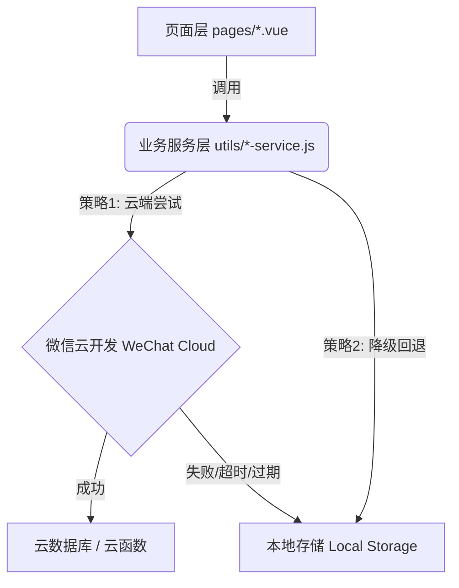

<div align="center">

# 🎓 Campus Student Exchanges App

**专为校园打造的高效二手交易与任务互助平台**

[](https://uniapp.dcloud.net.cn/)
[](https://vuejs.org/)
[](https://pinia.vuejs.org/)
[](https://mp.weixin.qq.com/)
[](./LICENSE)

---

</div>

## 📖 项目简介

这是一个生于校园、服务校园的综合性互助小程序，旨在解决大学生日常生活中高频的痛点需求，打通以下三条核心链路：

- 🛒 **二手交易**：一键发布 -> 智能筛选 -> 浏览心动 -> 实时联系
- 📌 **任务互助**：极速发单 -> 快递代取 -> 抢单大厅 -> 状态无缝流转
- 💬 **即时沟通**：独立会话 -> 实时消息 -> 商品/任务卡片一键发送

> 💡 **设计哲学：云端优先，无网不慌**  
> 本项目采用首创的 **「云优先 + 本地回退 (Cloud First, Local Fallback)」** 架构：  
> 当接入微信云开发（CloudBase）时，全量功能上云；当无网络或云环境配置缺失时，系统会自动平滑降级至 LocalStorage，确保开发调试永不阻塞！

---

## ✨ 核心亮点

- 🔗 **业务闭环清晰**：商品、任务、聊天三大模块底层打通，从浏览到沟通无缝衔接。
- ⚡ **实时能力兜底**：消息推送采用 `watch` (WebSocket) + `polling` (长轮询) 双通道机制，极致稳定。
- 🎨 **现代化交互体验**：全面引入毛玻璃质感、微动效（点击缩放、卡片浮起）、交错入场动画，告别生硬。
- 📚 **工程化标杆**：包含详尽的开发计划、周报日志、Code Review 机制，开源共建毫无门槛。

---

## 📅 开发进度

| 阶段 | 周期 | 状态 | 核心交付成果 |
| :--- | :--- | :---: | :--- |
| **P1** | Week 1 | 🟢 **Done** | 项目骨架搭建、登录态打通、首页重构、商品列表基础能力 |
| **P2** | Week 2 | 🟢 **Done** | 商品发布/详情/高级筛选/我的商品 + 全局 UI 与动画规范收口 |
| **P3** | Week 3 | 🟢 **Done** | 任务大厅云 watch + 轮询降级、聊天会话/消息 watch + 未读红点与 TabBar 角标、聊天消息按 id 去重、统一错误码与 showError、风控限流与审计 |
| **P4-W4** | Week 4 | 🟢 **Done** | 求购广场、到货提醒（订阅设置 + 新商品匹配推送 + 「匹配到你的新商品」列表）、订单系统（列表/详情/双确认/评价已有） |
| **P4-W5~8** | Week 5~8 | ⚪ **Plan** | 校园动态、积分任务、维基沉淀及提审上线 |

---

## 🛠 功能地图

### ✅ 已上线 (Available Now)

- **商品模块**：瀑布流列表、高级多维筛选、图文详情、一键发布、收藏、我的商品管理。
- **任务模块**：任务互助大厅、一键派单、详情追踪、我的任务聚合、特色快递专区。
- **聊天模块**：实时会话列表、聊天详情、支持图文与「商品/任务专属卡片」发送。
- **工程底座**：静态资源自动同步映射、全局 SCSS 语义变量库、异常降级日志拦截。
- **风控审计**：提供本地调试审计台页面（`/pages/admin/audit`），支持审计日志查询、统计与导出（JSON/CSV）。
- **实时与一致性**：任务大厅待接单任务使用云 watch，失败时自动降级轮询；聊天会话列表与单会话消息均支持 watch，未读数同步至 TabBar 角标；聊天消息按 `id` 合并去重；快递专区为按需/下拉刷新，任务状态以详情页与云端条件更新为准。
- **求购与到货提醒**：求购列表/发布/我的求购、分类与关键词订阅；商品发布后云函数匹配求购并写入到货提醒，到货提醒页展示「匹配到你的新商品」列表并可跳转商品详情。

### 🚀 开发中 (In Progress)
- 暂无；下一阶段见 P4 Week 5~8 规划。

---

## 🏗 技术架构



### 🧰 技术栈明细

| 领域 | 核心技术选型 |
| :--- | :--- |
| **前端框架** | `uni-app`、`Vue 3 (Composition API)` |
| **状态管理** | `Pinia` |
| **UI 组件与样式** | `uview-plus`、原生 `SCSS` 全局变量控制 |
| **构建工具** | `Vite`、`@dcloudio/vite-plugin-uni` |
| **运行平台** | 微信小程序（`mp-weixin`） |
| **后端能力** | 微信云开发（云数据库 / 云函数 / 云存储） |

---

## 📂 项目结构

```text
Campus-student-exchanges-app/
├─ pages/              # 视图层（首页/商品/任务/聊天/个人中心）
├─ components/         # 业务公共组件（如 ProductCard, TaskCard）
├─ utils/              # 服务层（封装着 云优先+本地回退 的核心逻辑）
├─ store/              # Pinia 状态树（User, App等）
├─ cloudfunctions/     # 微信云函数模板定义
├─ static/             # 静态图片/图标资源
├─ docs/               # 工程化文档（计划、日志、PR Review）
├─ pages.json          # 小程序路由与全局窗体配置
├─ manifest.json       # uni-app 平台配置
└─ vite.config.js      # Vite 构建脚本及插件配置
```

---

## 🚀 快速启动

### 1) 环境准备

- Node.js >= 18
- npm >= 9
- 微信开发者工具 (最新版)

### 2) 安装依赖

```bash
npm install
```

### 3) 启动开发服务 (实时热更)

```bash
npm run dev:mp-weixin
```

### 4) 生产环境构建

```bash
npm run build:mp-weixin
```

### 5) 开发者工具导入

- 在微信开发者工具中，导入项目根目录下的 **`dist/dev/mp-weixin`** 文件夹。
- 在工具栏的「云开发」面板中配置并初始化你的云环境（若暂不配置，系统将平滑降级至本地模式）。

---

## 📚 文档导航

欲了解详细的项目演进脉络，请查阅以下文档：

- 🎯 **全局蓝图**：[`development-plan.md`](./development-plan.md)
- 📅 **排期明细**：[`docs/all-weeks-detailed-plan.md`](./docs/all-weeks-detailed-plan.md)
- 🏃 **当前冲刺**：[`docs/week3-execution-plan.md`](./docs/week3-execution-plan.md)
- 📝 **工作日志**：[`docs/week2-work-log.md`](./docs/week2-work-log.md) & [`docs/week3-work-log.md`](./docs/week3-work-log.md)

---

## 🛡 错误码与调试

- **统一错误码**：业务层通过 `utils/app-errors.js` 抛出标准 `code`，页面层统一使用 `utils/error-handler.js` 的 `showError()` 展示用户提示。
- **常用错误码**：`AUTH_REQUIRED`（需登录）、`RATE_LIMIT`（操作频繁）、`DUPLICATE_SUBMIT`（重复提交）、`INVALID_PARAM`（参数非法）、`INVALID_STATE`（状态不允许）、`STATUS_CONFLICT`（并发冲突）。
- **审计调试页**：在设置页进入 `风控审计台（调试）`（路由：`/pages/admin/audit`），可按动作/用户筛选，查看统计并导出 JSON/CSV（复制到剪贴板）。
- **建议实践**：新增业务接口时，优先抛带 `code` 的错误；页面侧避免直接写死 toast 文案，尽量走 `showError(error, { title })`。

---

## 🤝 参与贡献

我们非常欢迎来自社区的 Issue 与 Pull Request！在贡献代码前，请先阅读：

- 🛠 贡献指南：[`CONTRIBUTING.md`](./CONTRIBUTING.md)
- 🛡 安全策略：[`SECURITY.md`](./SECURITY.md)
- 📦 变更日志：[`CHANGELOG.md`](./CHANGELOG.md)

---

## ❓ 常见问题 (FAQ)

**Q：为什么 TabBar 图标在微信开发者工具里不显示？**  
A：项目已在 `vite.config.js` 增加静态资源复制插件，确保你在运行 `npm run dev:mp-weixin` 后，`static/` 目录会被同步至 `dist/dev/mp-weixin/static`。请检查终端构建日志是否报错。

**Q：终端一直报 Sass deprecation warning，这会影响开发吗？**  
A：不影响。这是由于底层依赖的 Sass 编译器版本告警，属于已知非阻塞问题，后续会随 uview-plus 依赖更新而消除。

**Q：为什么登录或者加载商品感觉有点卡（超过3秒）？**  
A：如果你长时间未使用开发者工具导致 `access_token` 过期，云端请求会等待超时后才会走本地降级。解决办法：点击开发者工具上方 **「清缓存 -> 全部清除」** 并重新编译即可。

---

## 📄 License

本项目采用 [MIT License](./LICENSE) 许可证开源。
