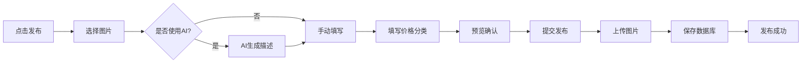
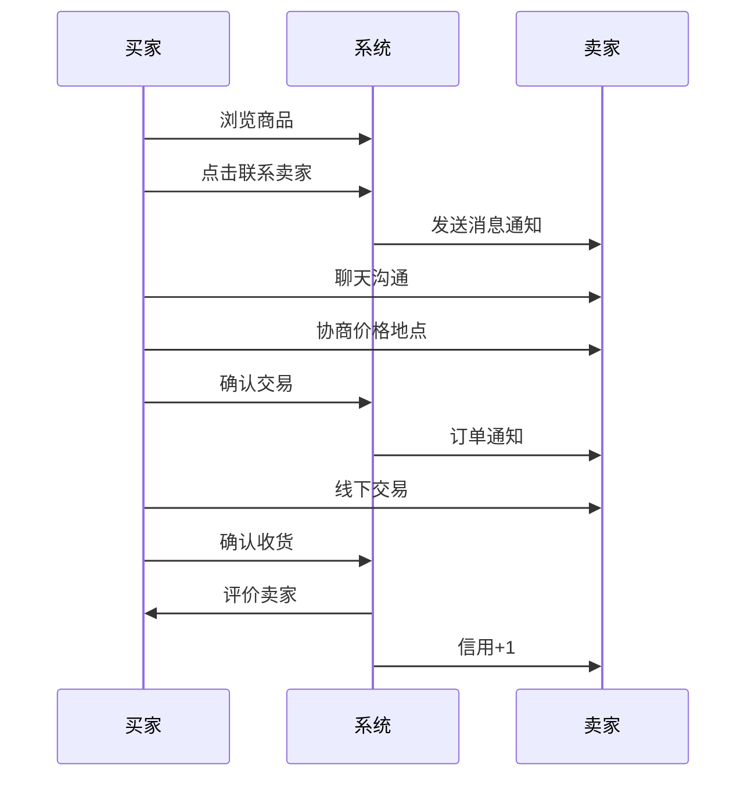

# 校园跳蚤市场 - 手机APP开发计划

> 📱 基于微信小程序的校园二手交易与任务发布平台
> 
> **项目周期：** 6周  
> **目标用户：** 在校大学生  
> **核心价值：** 便捷的校园二手交易 + 限时任务发布 + 校园信息共享

---

## 📋 目录

- [一、项目概述](#一项目概述)
- [二、技术方案](#二技术方案)
- [三、功能模块](#三功能模块)
- [四、开发计划](#四开发计划)
- [五、团队分工](#五团队分工)
- [六、环境搭建](#六环境搭建)
- [七、数据库设计](#七数据库设计)
- [八、核心功能实现](#八核心功能实现)
- [九、AI功能集成](#九ai功能集成)
- [十、测试方案](#十测试方案)
- [十一、部署上线](#十一部署上线)
- [十二、成本预算](#十二成本预算)
- [十三、风险管理](#十三风险管理)
- [附录：开发资源](#附录开发资源)

---

## 一、项目概述

### 1.1 项目背景

校园内学生需要一个便捷的平台来：
- 出售/购买二手物品（教材、数码产品、生活用品等）
- 发布/接取限时任务（代课、站岗、代会、代取快递等）
- 获取校园生活信息（建筑介绍、生活指南、学习资源）

### 1.2 为什么选择微信小程序？

| 优势 | 说明 |
|------|------|
| **零安装成本** | 扫码即用，推广成本极低 |
| **100%覆盖率** | 所有大学生都使用微信 |
| **生态完善** | 微信支付、分享、客服、通知一应俱全 |
| **开发快速** | uni-app一套代码，多端运行 |
| **审核简单** | 比iOS/Android APP审核快3-5倍 |
| **成本低廉** | 前期云开发免费额度充足 |

### 1.3 核心特色

- 🤖 **AI智能助手**：一键生成商品描述，提高发布效率
- 💬 **实时聊天**：买卖双方即时沟通，交易更高效
- 📍 **校园定位**：基于校园位置的商品推荐
- 🔔 **消息推送**：新订单、新消息实时提醒
- 🎯 **精准分类**：教材、数码、生活、运动等细分类别
- ⭐ **信用评价**：建立校园内部信用体系

---

## 二、技术方案

### 2.1 整体技术架构

```
┌─────────────────────────────────────────────────────────┐
│                     微信小程序前端                          │
│                   (uni-app + Vue 3)                      │
│                                                          │
│  ┌──────────┐  ┌──────────┐  ┌──────────┐  ┌──────────┐│
│  │  首页    │  │  发布    │  │  聊天    │  │  个人    ││
│  │ 商品流   │  │  商品/   │  │  实时    │  │  中心    ││
│  │          │  │  任务    │  │  通讯    │  │          ││
│  └──────────┘  └──────────┘  └──────────┘  └──────────┘│
└─────────────────────────────────────────────────────────┘
                            ▼
┌─────────────────────────────────────────────────────────┐
│                     微信云开发                            │
│                                                          │
│  ┌──────────┐  ┌──────────┐  ┌──────────┐  ┌──────────┐│
│  │ 云数据库  │  │ 云存储   │  │ 云函数   │  │ 云调用   ││
│  │ MongoDB  │  │ 图片视频  │  │ Node.js  │  │ 小程序   ││
│  │          │  │          │  │ (AI)     │  │ API      ││
│  └──────────┘  └──────────┘  └──────────┘  └──────────┘│
└─────────────────────────────────────────────────────────┘
                            ▼
┌─────────────────────────────────────────────────────────┐
│                    第三方服务                             │
│                                                          │
│  Claude API     微信支付      腾讯地图      微信模板消息   │
│  (AI生成)       (可选)       (定位)        (通知推送)     │
└─────────────────────────────────────────────────────────┘
```

### 2.2 技术栈选择

#### 前端技术
```yaml
框架: uni-app 3.x (基于 Vue 3)
  理由: 一套代码，多端运行（小程序/H5/APP）
  
UI组件库: uView UI 3.0
  理由: 专为uni-app设计，组件丰富，文档完善
  
状态管理: Pinia
  理由: Vue 3官方推荐，比Vuex更简洁
  
网络请求: uni.request + 封装
  理由: 统一管理请求拦截、错误处理
  
图片处理: uni.chooseImage + 压缩
  理由: 小程序原生API，性能最优
```

#### 后端技术
```yaml
服务: 微信云开发
  - 云数据库: MongoDB (NoSQL，灵活的数据结构)
  - 云存储: 图片、文件存储
  - 云函数: Node.js 12+
  - 云调用: 调用微信服务端API
  
理由:
  ✓ 无需购买服务器
  ✓ 免运维
  ✓ 天然鉴权
  ✓ 前期免费额度充足
```

#### AI能力
```yaml
AI服务: Claude API (Anthropic)
  模型: claude-sonnet-4-20250514
  
功能:
  - 商品描述生成
  - 图片智能识别
  - 智能分类推荐
  - 价格建议
```

### 2.3 开发工具

| 工具 | 用途 | 下载地址 |
|------|------|----------|
| **HBuilderX** | uni-app官方IDE | https://www.dcloud.io/hbuilderx.html |
| **微信开发者工具** | 小程序调试 | https://developers.weixin.qq.com/miniprogram/dev/devtools/download.html |
| **VS Code** | 代码编辑（可选） | https://code.visualstudio.com/ |
| **Apifox** | API测试工具 | https://apifox.com/ |

---

## 三、功能模块

### 3.1 功能架构图

```
校园跳蚤市场小程序
│
├── 🏠 首页模块
│   ├── 商品推荐流（瀑布流/九宫格）
│   ├── 分类导航
│   ├── 搜索功能
│   └── Banner轮播
│
├── 🛍️ 二手商品模块
│   ├── 商品列表
│   │   ├── 分类筛选
│   │   ├── 价格排序
│   │   ├── 关键词搜索
│   │   └── 分页加载
│   ├── 商品详情
│   │   ├── 图片轮播
│   │   ├── 商品信息
│   │   ├── 卖家信息
│   │   └── 联系按钮
│   ├── 发布商品
│   │   ├── 图片上传（最多9张）
│   │   ├── AI生成描述 ⭐
│   │   ├── 表单填写
│   │   └── 提交审核
│   └── 我的商品
│       ├── 在售中
│       ├── 已售出
│       └── 已下架
│
├── 📋 限时任务模块
│   ├── 任务大厅
│   │   ├── 任务列表
│   │   ├── 类型筛选（代课/站岗/代会等）
│   │   ├── 报酬排序
│   │   └── 距离排序
│   ├── 任务详情
│   │   ├── 任务信息
│   │   ├── 发布者信息
│   │   └── 接单按钮
│   ├── 发布任务
│   │   ├── 任务类型选择
│   │   ├── 时间选择
│   │   ├── 报酬设置
│   │   └── 任务描述
│   └── 我的任务
│       ├── 我发布的
│       ├── 我接取的
│       └── 历史记录
│
├── 💬 聊天模块
│   ├── 会话列表
│   │   ├── 未读消息提示
│   │   ├── 最新消息预览
│   │   └── 时间显示
│   ├── 聊天详情
│   │   ├── 消息气泡
│   │   ├── 发送文字
│   │   ├── 发送图片
│   │   └── 实时更新 ⭐
│   └── 消息推送
│       ├── 新消息通知
│       └── 订单提醒
│
├── 📖 校园维基模块
│   ├── 校园建筑
│   ├── 生活指南
│   ├── 学习资源
│   └── 内容评论
│
├── 👤 个人中心模块
│   ├── 个人信息
│   │   ├── 头像昵称
│   │   ├── 学号验证
│   │   ├── 联系方式
│   │   └── 信用评分
│   ├── 我的订单
│   │   ├── 买家订单
│   │   └── 卖家订单
│   ├── 我的收藏
│   ├── 浏览历史
│   └── 设置
│       ├── 消息通知
│       ├── 隐私设置
│       └── 关于我们
│
└── 🔐 认证模块
    ├── 微信登录
    ├── 学号绑定
    └── 手机验证
```

### 3.2 核心功能详细说明

#### 3.2.1 商品发布流程



#### 3.2.2 交易流程



---

## 四、开发计划

### 4.1 总体时间线（6周）

```
Week 1: 环境搭建 + 基础框架
Week 2: 核心功能开发（商品模块）
Week 3: 任务模块 + 聊天功能
Week 4: AI功能集成 + 优化
Week 5: 维基模块 + 订单系统
Week 6: 测试 + 上线
```

### 4.2 详细开发计划

#### 📅 Week 1: 环境搭建 + 基础框架 (2.10 - 2.16)

**目标：** 搭建完整开发环境，完成项目框架

| 日期 | 任务 | 负责人 | 产出 |
|------|------|--------|------|
| **Day 1** | 注册小程序账号，开通云开发 | PM | 小程序AppID |
| | 安装开发工具 | 全员 | HBuilderX + 微信开发者工具 |
| **Day 2** | 创建uni-app项目 | 前端组 | 项目骨架 |
| | 配置uView UI | 前端组 | UI组件库集成 |
| **Day 3** | 设计数据库结构 | 后端组 | 数据库设计文档 |
| | 初始化云开发环境 | 后端组 | 云数据库+云存储 |
| **Day 4** | 完成登录页面 | 前端组 | 微信登录功能 |
| | 完成首页布局 | 前端组 | 首页框架 |
| **Day 5** | 完成底部导航 | 前端组 | Tab Bar |
| | 封装请求工具 | 后端组 | API封装 |
| **Day 6-7** | 完成商品列表页 | 前端组 | 商品展示 |
| | 测试云开发功能 | 后端组 | 云开发调试 |

**里程碑：** ✅ 可以登录，可以查看商品列表

---

#### 📅 Week 2: 核心功能开发 (2.17 - 2.23)

**目标：** 完成商品发布和详情功能

| 日期 | 任务 | 负责人 | 产出 |
|------|------|--------|------|
| **Day 1-2** | 商品发布页面 | 前端组 | 发布表单 |
| | 图片上传功能 | 前端组 | 图片压缩+上传 |
| **Day 3** | 商品详情页 | 前端组 | 详情展示 |
| | 商品数据接口 | 后端组 | CRUD接口 |
| **Day 4** | 分类筛选功能 | 前端组 | 筛选组件 |
| | 搜索功能 | 前端组 | 搜索框+接口 |
| **Day 5** | 我的商品页面 | 前端组 | 个人商品管理 |
| | 商品状态管理 | 后端组 | 上架/下架/删除 |
| **Day 6-7** | 功能联调测试 | 全员 | Bug修复 |

**里程碑：** ✅ 可以发布商品，可以查看详情，可以搜索

---

#### 📅 Week 3: 任务模块 + 聊天功能 (2.24 - 3.2)

**目标：** 完成任务大厅和实时聊天

| 日期 | 任务 | 负责人 | 产出 |
|------|------|--------|------|
| **Day 1-2** | 任务大厅页面 | 前端组 | 任务列表 |
| | 任务发布页面 | 前端组 | 发布表单 |
| **Day 3** | 任务详情页 | 前端组 | 详情+接单 |
| | 任务数据接口 | 后端组 | CRUD接口 |
| **Day 4-5** | 聊天列表页 | 前端组 | 会话列表 |
| | 聊天详情页 | 前端组 | 消息界面 |
| **Day 6** | 实时消息功能 | 后端组 | 云数据库watch |
| | 消息推送 | 后端组 | 订阅消息 |
| **Day 7** | 功能测试 | 全员 | Bug修复 |

**里程碑：** ✅ 可以发布任务，可以实时聊天

---

#### 📅 Week 4: AI功能集成 + 优化 (3.3 - 3.9)

**目标：** 集成AI能力，优化用户体验

| 日期 | 任务 | 负责人 | 产出 |
|------|------|--------|------|
| **Day 1** | 注册Claude API | 后端组 | API Key |
| | 创建AI云函数 | 后端组 | 云函数代码 |
| **Day 2-3** | 前端AI按钮 | 前端组 | AI生成界面 |
| | 测试AI生成 | 全员 | 调试优化 |
| **Day 4** | 性能优化 | 前端组 | 图片懒加载 |
| | 缓存优化 | 前端组 | 本地存储 |
| **Day 5** | UI优化 | 前端组 | 动画+交互 |
| | 加载优化 | 前端组 | 骨架屏 |
| **Day 6-7** | 全面测试 | 全员 | 问题清单 |

**里程碑：** ✅ AI功能可用，性能流畅

---

#### 📅 Week 5: 维基模块 + 订单系统 (3.10 - 3.16)

**目标：** 完成剩余功能模块

| 日期 | 任务 | 负责人 | 产出 |
|------|------|--------|------|
| **Day 1-2** | 校园维基页面 | 前端组 | 内容展示 |
| | 内容管理接口 | 后端组 | 后台管理 |
| **Day 3-4** | 订单系统 | 前端组 | 订单页面 |
| | 订单逻辑 | 后端组 | 订单接口 |
| **Day 5** | 个人中心完善 | 前端组 | 设置+关于 |
| | 信用评分系统 | 后端组 | 评分算法 |
| **Day 6-7** | 整体测试 | 全员 | 全功能测试 |

**里程碑：** ✅ 所有功能开发完成

---

#### 📅 Week 6: 测试 + 上线 (3.17 - 3.23)

**目标：** 全面测试，提交审核，正式上线

| 日期 | 任务 | 负责人 | 产出 |
|------|------|--------|------|
| **Day 1-2** | 功能测试 | 测试组 | 测试报告 |
| | Bug修复 | 开发组 | Bug清零 |
| **Day 3** | 兼容性测试 | 测试组 | 机型测试 |
| | 性能测试 | 测试组 | 性能报告 |
| **Day 4** | 准备审核材料 | PM | 文档+截图 |
| | 配置服务器类目 | PM | 类目申请 |
| **Day 5** | 提交审核 | PM | 审核中 |
| | 准备运营素材 | PM | 海报+文案 |
| **Day 6-7** | 试运行 | 全员 | 收集反馈 |
| | 正式发布 | PM | 🎉上线 |

**里程碑：** ✅ 小程序正式上线

---

### 4.3 每日站会制度

**时间：** 每天早上10:00  
**时长：** 15分钟  
**形式：** 线上/线下

**分享内容：**
1. 昨天完成了什么？
2. 今天计划做什么？
3. 遇到什么问题？

---

## 五、团队分工

### 5.1 团队结构（建议6-8人）

```
项目经理 (PM) x 1
    ├── 前端开发组 x 2-3人
    ├── 后端开发组 x 2人
    └── 测试组 x 1-2人
```

### 5.2 详细职责

#### 👨‍💼 项目经理 (1人)

**核心职责：**
- 📊 制定项目计划，把控整体进度
- 🎯 协调各组工作，解决资源冲突
- 📝 对接需求方，收集用户反馈
- 📈 每周迭代review，调整开发计划
- 🚀 负责小程序审核和发布

**工作产出：**
- 项目计划文档
- 每周进度报告
- 需求变更记录
- 审核提交材料

---

#### 💻 前端开发组 (2-3人)

**核心职责：**
- 🎨 UI界面设计与实现
- 🔧 组件开发与封装
- 📱 页面交互逻辑
- 🔌 API对接
- 🐛 前端bug修复

**技术要求：**
- 熟悉Vue.js基础
- 了解uni-app框架
- 掌握uView UI组件
- 了解微信小程序API

**工作产出：**
- 所有页面组件
- 公共组件库
- 前端工具函数
- 页面交互效果

**分工建议：**
- **前端1**：负责商品模块（列表、详情、发布）
- **前端2**：负责任务模块 + 聊天模块
- **前端3**（可选）：负责个人中心 + 维基模块

---

#### ⚙️ 后端开发组 (2人)

**核心职责：**
- 🗄️ 数据库设计与优化
- 🔧 云函数开发
- 🔐 权限控制
- 🤖 AI功能集成
- 📊 数据统计

**技术要求：**
- 熟悉Node.js
- 了解MongoDB
- 掌握微信云开发
- 了解RESTful API设计

**工作产出：**
- 数据库设计文档
- 云函数代码
- AI云函数
- 接口文档

**分工建议：**
- **后端1**：负责数据库设计 + 核心业务云函数
- **后端2**：负责AI功能 + 消息推送 + 数据统计

---

#### 🧪 测试组 (1-2人)

**核心职责：**
- 📝 编写测试用例
- 🔍 功能测试
- 📱 兼容性测试
- 🐛 Bug跟踪管理
- 📊 测试报告

**测试范围：**
- 功能完整性
- 用户体验
- 性能表现
- 机型兼容
- 异常处理

**工作产出：**
- 测试用例文档
- Bug清单
- 测试报告
- 上线检查清单

---

### 5.3 协作工具

| 工具 | 用途 | 负责人 |
|------|------|--------|
| **GitHub** | 代码托管 + 版本控制 | PM配置 |
| **Trello/飞书** | 任务管理 + 看板 | PM维护 |
| **企业微信/钉钉** | 日常沟通 | 全员 |
| **腾讯文档** | 文档协作 | 全员 |
| **Figma** | UI设计稿 | 前端组 |

---

## 六、环境搭建

### 6.1 开发环境准备

#### Step 1: 注册微信小程序

1. 访问 https://mp.weixin.qq.com/
2. 注册小程序账号（企业/个人）
3. 完成认证（学校可申请免费认证）
4. 获取 **AppID**（重要！）

#### Step 2: 安装开发工具

```bash
# 1. 下载HBuilderX
# 访问：https://www.dcloud.io/hbuilderx.html
# 选择：正式版 - Windows/Mac

# 2. 下载微信开发者工具
# 访问：https://developers.weixin.qq.com/miniprogram/dev/devtools/download.html

# 3. 安装Node.js（云函数开发需要）
# 访问：https://nodejs.org/
# 下载：LTS版本（18.x以上）

# 验证安装
node -v  # 应显示 v18.x.x
npm -v   # 应显示 9.x.x
```

#### Step 3: 开通云开发

1. 在微信开发者工具中打开小程序
2. 点击"云开发"按钮
3. 开通云开发服务
4. 获取**环境ID**（env-xxx）

---

### 6.2 创建uni-app项目

#### 方式一：HBuilderX创建（推荐）

1. 打开HBuilderX
2. 文件 → 新建 → 项目
3. 选择 `uni-app`
4. 模板选择：`uni-app` (Vue3)
5. 项目名称：`campus-market`
6. 点击创建

#### 方式二：命令行创建

```bash
# 使用官方脚手架
npx degit dcloudio/uni-preset-vue#vite campus-market
cd campus-market

# 安装依赖
npm install

# 运行到微信小程序
npm run dev:mp-weixin
```

---

### 6.3 安装uView UI

```bash
# 进入项目目录
cd campus-market

# 安装uView UI 3.0
npm install uview-plus

# 或使用HBuilderX插件市场安装
# 工具 → 插件安装 → 搜索"uView UI"
```

**配置uView**

```javascript
// main.js
import { createSSRApp } from 'vue'
import uviewPlus from 'uview-plus'

export function createApp() {
  const app = createSSRApp(App)
  
  // 使用uView UI
  app.use(uviewPlus)
  
  return { app }
}
```

```css
/* App.vue */
<style lang="scss">
  @import 'uview-plus/index.scss';
</style>
```

---

### 6.4 配置小程序AppID

```json
// manifest.json
{
  "mp-weixin": {
    "appid": "你的AppID",
    "setting": {
      "urlCheck": false
    },
    "cloudfunctionRoot": "cloudfunctions/"
  }
}
```

---

### 6.5 项目目录结构

```
campus-market/
├── pages/                          # 页面
│   ├── index/                      # 首页
│   │   └── index.vue
│   ├── login/                      # 登录
│   │   └── login.vue
│   ├── products/                   # 商品模块
│   │   ├── list.vue               # 商品列表
│   │   ├── detail.vue             # 商品详情
│   │   └── publish.vue            # 发布商品
│   ├── tasks/                      # 任务模块
│   │   ├── list.vue
│   │   ├── detail.vue
│   │   └── publish.vue
│   ├── chat/                       # 聊天模块
│   │   ├── list.vue               # 会话列表
│   │   └── detail.vue             # 聊天详情
│   ├── wiki/                       # 维基模块
│   │   └── index.vue
│   └── profile/                    # 个人中心
│       ├── index.vue
│       ├── my-products.vue
│       └── my-orders.vue
│
├── components/                     # 组件
│   ├── product-card/              # 商品卡片
│   ├── task-card/                 # 任务卡片
│   ├── chat-item/                 # 聊天项
│   └── empty-state/               # 空状态
│
├── static/                         # 静态资源
│   ├── images/
│   ├── icons/
│   └── logo.png
│
├── utils/                          # 工具函数
│   ├── request.js                 # 请求封装
│   ├── auth.js                    # 认证工具
│   ├── upload.js                  # 上传工具
│   └── validate.js                # 验证工具
│
├── store/                          # 状态管理
│   ├── index.js
│   ├── user.js
│   └── chat.js
│
├── cloudfunctions/                 # 云函数
│   ├── generateProductDesc/       # AI生成描述
│   ├── createOrder/               # 创建订单
│   └── sendMessage/               # 发送消息
│
├── uni_modules/                    # uni-app插件
│   └── uview-plus/
│
├── App.vue                         # 应用配置
├── main.js                         # 入口文件
├── manifest.json                   # 应用配置
├── pages.json                      # 页面配置
└── uni.scss                        # 全局样式
```

---

### 6.6 配置pages.json

```json
{
  "pages": [
    {
      "path": "pages/index/index",
      "style": {
        "navigationBarTitleText": "校园跳蚤市场"
      }
    },
    {
      "path": "pages/products/list",
      "style": {
        "navigationBarTitleText": "商品列表"
      }
    }
  ],
  "tabBar": {
    "color": "#999999",
    "selectedColor": "#5677fc",
    "backgroundColor": "#ffffff",
    "list": [
      {
        "pagePath": "pages/index/index",
        "text": "首页",
        "iconPath": "static/tabbar/home.png",
        "selectedIconPath": "static/tabbar/home-active.png"
      },
      {
        "pagePath": "pages/tasks/list",
        "text": "任务",
        "iconPath": "static/tabbar/task.png",
        "selectedIconPath": "static/tabbar/task-active.png"
      },
      {
        "pagePath": "pages/chat/list",
        "text": "消息",
        "iconPath": "static/tabbar/chat.png",
        "selectedIconPath": "static/tabbar/chat-active.png"
      },
      {
        "pagePath": "pages/profile/index",
        "text": "我的",
        "iconPath": "static/tabbar/profile.png",
        "selectedIconPath": "static/tabbar/profile-active.png"
      }
    ]
  }
}
```

---

## 七、数据库设计

### 7.1 云数据库集合（Collection）

#### 集合1: users (用户表)

```javascript
{
  "_id": "user001",                    // 自动生成
  "_openid": "oxxx",                   // 微信openid（云开发自动）
  "studentId": "2021001",              // 学号（唯一）
  "name": "张三",                       // 姓名
  "avatar": "https://...",             // 头像
  "phone": "13800138000",              // 手机号
  "wechat": "zhangsan123",             // 微信号
  "bio": "喜欢数码产品",                 // 个人简介
  "rating": 4.8,                       // 信用评分
  "ratingCount": 15,                   // 评价次数
  "schoolId": "school001",             // 学校ID
  "collegeId": "college001",           // 学院ID
  "createdAt": 1676889600000,          // 注册时间
  "updatedAt": 1676889600000           // 更新时间
}
```

**索引设计：**
```javascript
db.collection('users').createIndex({
  "studentId": 1  // 唯一索引
})
```

---

#### 集合2: products (商品表)

```javascript
{
  "_id": "prod001",
  "title": "Java核心技术（第11版）",    // 标题
  "description": "9成新，无笔记...",   // 描述
  "price": 45.00,                      // 价格
  "originalPrice": 89.00,              // 原价（可选）
  "category": "books",                 // 分类
  "condition": "9成新",                 // 成色
  "images": [                          // 图片数组
    "cloud://xxx.jpg",
    "cloud://xxx2.jpg"
  ],
  "location": "东区宿舍楼下",            // 交易地点
  "tags": ["教材", "计算机"],           // 标签
  "status": "available",               // 状态：available/reserved/sold/deleted
  "views": 128,                        // 浏览次数
  "favorites": 5,                      // 收藏次数
  "userId": "user001",                 // 卖家ID
  "userName": "张三",                   // 卖家昵称
  "userAvatar": "https://...",         // 卖家头像
  "aiGenerated": true,                 // 是否AI生成描述
  "createdAt": 1676889600000,
  "updatedAt": 1676889600000
}
```

**索引设计：**
```javascript
db.collection('products').createIndex({
  "status": 1,
  "category": 1,
  "createdAt": -1
})

db.collection('products').createIndex({
  "userId": 1,
  "status": 1
})
```

---

#### 集合3: tasks (任务表)

```javascript
{
  "_id": "task001",
  "title": "代课：高数下周二3-4节",     // 标题
  "description": "数学系，需要...",    // 描述
  "type": "代课",                      // 类型：代课/站岗/代会/代取快递等
  "reward": 20.00,                    // 报酬
  "location": "教学楼A101",            // 地点
  "time": "2024-02-20 10:00",         // 时间
  "duration": 90,                     // 时长（分钟）
  "requirements": "需要男生",          // 要求
  "status": "open",                   // 状态：open/assigned/completed/cancelled
  "userId": "user001",                // 发布者ID
  "assignedUserId": null,             // 接单者ID
  "assignedAt": null,                 // 接单时间
  "completedAt": null,                // 完成时间
  "createdAt": 1676889600000
}
```

**索引设计：**
```javascript
db.collection('tasks').createIndex({
  "status": 1,
  "type": 1,
  "createdAt": -1
})
```

---

#### 集合4: conversations (会话表)

```javascript
{
  "_id": "conv001",
  "participants": [                   // 参与者数组
    "user001",
    "user002"
  ],
  "lastMessage": {
    "content": "好的，明天见",
    "senderId": "user001",
    "createdAt": 1676889600000
  },
  "unreadCount": {                    // 未读数对象
    "user001": 0,
    "user002": 2
  },
  "relatedProduct": "prod001",        // 关联商品（可选）
  "createdAt": 1676889600000,
  "updatedAt": 1676889600000
}
```

---

#### 集合5: messages (消息表)

```javascript
{
  "_id": "msg001",
  "conversationId": "conv001",        // 会话ID
  "senderId": "user001",              // 发送者ID
  "receiverId": "user002",            // 接收者ID
  "type": "text",                     // 类型：text/image/product/task
  "content": "这个商品还在吗？",        // 内容
  "imageUrl": null,                   // 图片URL（type=image时）
  "isRead": false,                    // 是否已读
  "createdAt": 1676889600000
}
```

**索引设计：**
```javascript
db.collection('messages').createIndex({
  "conversationId": 1,
  "createdAt": -1
})
```

---

#### 集合6: orders (订单表)

```javascript
{
  "_id": "order001",
  "productId": "prod001",             // 商品ID
  "buyerId": "user002",               // 买家ID
  "sellerId": "user001",              // 卖家ID
  "price": 45.00,                     // 成交价
  "status": "pending",                // 状态：pending/completed/cancelled
  "meetingLocation": "东区宿舍楼下",   // 交易地点
  "meetingTime": "2024-02-20 15:00",  // 交易时间
  "completedAt": null,                // 完成时间
  "rating": null,                     // 评分（1-5星）
  "comment": null,                    // 评价
  "createdAt": 1676889600000
}
```

---

#### 集合7: wiki (维基内容表)

```javascript
{
  "_id": "wiki001",
  "title": "图书馆使用指南",           // 标题
  "category": "生活指南",              // 分类
  "content": "图书馆位于...",         // 内容（富文本）
  "images": ["https://..."],          // 图片
  "tags": ["图书馆", "学习"],          // 标签
  "views": 256,                       // 浏览次数
  "likes": 18,                        // 点赞数
  "authorId": "user001",              // 作者ID
  "createdAt": 1676889600000,
  "updatedAt": 1676889600000
}
```

---

### 7.2 数据库权限设置

```javascript
// 云开发控制台 → 数据库 → 权限设置

// users集合：仅创建者可读写
{
  "read": "doc._openid == auth.openid",
  "write": "doc._openid == auth.openid"
}

// products集合：所有人可读，仅创建者可写
{
  "read": true,
  "write": "doc._openid == auth.openid"
}

// messages集合：仅参与者可读写
{
  "read": "doc.senderId == auth.openid || doc.receiverId == auth.openid",
  "write": "doc.senderId == auth.openid"
}
```

---

## 八、核心功能实现

### 8.1 用户登录（微信授权）

```vue
<!-- pages/login/login.vue -->
<template>
  <view class="login-page">
    <view class="logo">
      <image src="/static/logo.png" mode="aspectFit" />
    </view>
    
    <view class="title">校园跳蚤市场</view>
    <view class="slogan">让闲置流动起来</view>
    
    <button 
      class="login-btn" 
      type="primary"
      @tap="handleLogin"
      :loading="loading"
    >
      <uni-icons type="weixin" color="#fff" size="20" />
      微信一键登录
    </button>
    
    <view class="tips">
      登录即代表同意《用户协议》和《隐私政策》
    </view>
  </view>
</template>

<script>
export default {
  data() {
    return {
      loading: false
    }
  },
  
  methods: {
    async handleLogin() {
      this.loading = true
      
      try {
        // 1. 获取用户信息授权
        const { userInfo } = await uni.getUserProfile({
          desc: '用于完善用户资料'
        })
        
        // 2. 调用云函数登录
        const res = await wx.cloud.callFunction({
          name: 'login',
          data: {
            userInfo
          }
        })
        
        // 3. 保存用户信息
        uni.setStorageSync('userInfo', res.result.userInfo)
        uni.setStorageSync('token', res.result.token)
        
        // 4. 判断是否需要绑定学号
        if (!res.result.userInfo.studentId) {
          uni.redirectTo({
            url: '/pages/bind-student/bind-student'
          })
        } else {
          uni.switchTab({
            url: '/pages/index/index'
          })
        }
        
      } catch (error) {
        console.error('登录失败', error)
        uni.showToast({
          title: '登录失败，请重试',
          icon: 'none'
        })
      }
      
      this.loading = false
    }
  }
}
</script>

<style lang="scss" scoped>
.login-page {
  height: 100vh;
  display: flex;
  flex-direction: column;
  align-items: center;
  justify-content: center;
  background: linear-gradient(135deg, #667eea 0%, #764ba2 100%);
  
  .logo {
    width: 200rpx;
    height: 200rpx;
    margin-bottom: 40rpx;
    
    image {
      width: 100%;
      height: 100%;
    }
  }
  
  .title {
    font-size: 48rpx;
    font-weight: bold;
    color: #fff;
    margin-bottom: 20rpx;
  }
  
  .slogan {
    font-size: 28rpx;
    color: rgba(255, 255, 255, 0.8);
    margin-bottom: 100rpx;
  }
  
  .login-btn {
    width: 600rpx;
    height: 88rpx;
    background: #fff;
    color: #5677fc;
    border-radius: 44rpx;
    font-size: 32rpx;
    display: flex;
    align-items: center;
    justify-content: center;
  }
  
  .tips {
    margin-top: 40rpx;
    font-size: 24rpx;
    color: rgba(255, 255, 255, 0.6);
  }
}
</style>
```

---

### 8.2 商品列表（瀑布流）

```vue
<!-- pages/products/list.vue -->
<template>
  <view class="products-page">
    <!-- 搜索栏 -->
    <view class="search-bar">
      <u-search 
        v-model="keyword"
        placeholder="搜索商品"
        @search="handleSearch"
        @custom="handleSearch"
      />
    </view>
    
    <!-- 分类标签 -->
    <scroll-view scroll-x class="category-scroll">
      <view 
        v-for="cat in categories" 
        :key="cat.value"
        :class="['category-item', {active: category === cat.value}]"
        @tap="selectCategory(cat.value)"
      >
        {{ cat.label }}
      </view>
    </scroll-view>
    
    <!-- 排序 -->
    <view class="filter-bar">
      <text 
        :class="['filter-item', {active: sortBy === 'time'}]"
        @tap="changeSort('time')"
      >
        最新
      </text>
      <text 
        :class="['filter-item', {active: sortBy === 'price'}]"
        @tap="changeSort('price')"
      >
        价格
      </text>
      <text 
        :class="['filter-item', {active: sortBy === 'views'}]"
        @tap="changeSort('views')"
      >
        热度
      </text>
    </view>
    
    <!-- 商品列表 - 瀑布流 -->
    <scroll-view 
      scroll-y 
      class="product-list"
      @scrolltolower="loadMore"
      :refresher-enabled="true"
      :refresher-triggered="refreshing"
      @refresherrefresh="onRefresh"
    >
      <view class="waterfall">
        <!-- 左列 -->
        <view class="column">
          <product-card 
            v-for="item in leftList" 
            :key="item._id"
            :product="item"
            @click="goDetail(item._id)"
          />
        </view>
        
        <!-- 右列 -->
        <view class="column">
          <product-card 
            v-for="item in rightList" 
            :key="item._id"
            :product="item"
            @click="goDetail(item._id)"
          />
        </view>
      </view>
      
      <!-- 加载状态 -->
      <view class="load-more">
        <text v-if="loading">加载中...</text>
        <text v-else-if="noMore">没有更多了</text>
      </view>
    </scroll-view>
    
    <!-- 发布按钮 -->
    <view class="float-btn" @tap="goPublish">
      <uni-icons type="plus" size="30" color="#fff" />
    </view>
  </view>
</template>

<script>
import ProductCard from '@/components/product-card/product-card.vue'

export default {
  components: { ProductCard },
  
  data() {
    return {
      keyword: '',
      category: 'all',
      categories: [
        {label: '全部', value: 'all'},
        {label: '教材', value: 'books'},
        {label: '数码', value: 'electronics'},
        {label: '生活', value: 'daily'},
        {label: '运动', value: 'sports'},
        {label: '其他', value: 'other'}
      ],
      sortBy: 'time',
      products: [],
      leftList: [],
      rightList: [],
      page: 1,
      pageSize: 20,
      loading: false,
      refreshing: false,
      noMore: false
    }
  },
  
  onLoad() {
    this.loadProducts()
  },
  
  methods: {
    // 加载商品列表
    async loadProducts() {
      if (this.loading || this.noMore) return
      
      this.loading = true
      
      try {
        const db = wx.cloud.database()
        const _ = db.command
        
        // 构建查询条件
        let where = {
          status: 'available'
        }
        
        // 分类筛选
        if (this.category !== 'all') {
          where.category = this.category
        }
        
        // 关键词搜索
        if (this.keyword) {
          where.title = db.RegExp({
            regexp: this.keyword,
            options: 'i'
          })
        }
        
        // 排序
        let orderBy = 'createdAt'
        let order = 'desc'
        
        if (this.sortBy === 'price') {
          orderBy = 'price'
          order = 'asc'
        } else if (this.sortBy === 'views') {
          orderBy = 'views'
          order = 'desc'
        }
        
        // 查询数据
        const { data } = await db.collection('products')
          .where(where)
          .orderBy(orderBy, order)
          .skip((this.page - 1) * this.pageSize)
          .limit(this.pageSize)
          .get()
        
        if (data.length < this.pageSize) {
          this.noMore = true
        }
        
        // 如果是第一页，重置列表
        if (this.page === 1) {
          this.products = data
          this.buildWaterfall(data)
        } else {
          this.products = [...this.products, ...data]
          this.buildWaterfall(data, true)
        }
        
      } catch (error) {
        console.error('加载失败', error)
        uni.showToast({
          title: '加载失败',
          icon: 'none'
        })
      }
      
      this.loading = false
      this.refreshing = false
    },
    
    // 构建瀑布流
    buildWaterfall(data, append = false) {
      if (!append) {
        this.leftList = []
        this.rightList = []
      }
      
      data.forEach(item => {
        // 简单实现：奇偶分配
        // 实际可根据图片高度智能分配
        if (this.leftList.length <= this.rightList.length) {
          this.leftList.push(item)
        } else {
          this.rightList.push(item)
        }
      })
    },
    
    // 下拉刷新
    onRefresh() {
      this.refreshing = true
      this.page = 1
      this.noMore = false
      this.loadProducts()
    },
    
    // 加载更多
    loadMore() {
      if (!this.loading && !this.noMore) {
        this.page++
        this.loadProducts()
      }
    },
    
    // 分类筛选
    selectCategory(value) {
      this.category = value
      this.page = 1
      this.noMore = false
      this.loadProducts()
    },
    
    // 排序
    changeSort(type) {
      this.sortBy = type
      this.page = 1
      this.noMore = false
      this.loadProducts()
    },
    
    // 搜索
    handleSearch() {
      this.page = 1
      this.noMore = false
      this.loadProducts()
    },
    
    // 跳转详情
    goDetail(id) {
      uni.navigateTo({
        url: `/pages/products/detail?id=${id}`
      })
    },
    
    // 发布商品
    goPublish() {
      uni.navigateTo({
        url: '/pages/products/publish'
      })
    }
  }
}
</script>

<style lang="scss" scoped>
.products-page {
  height: 100vh;
  display: flex;
  flex-direction: column;
  background: #f5f5f5;
}

.search-bar {
  padding: 20rpx 30rpx;
  background: #fff;
}

.category-scroll {
  white-space: nowrap;
  padding: 20rpx 30rpx;
  background: #fff;
  border-bottom: 1rpx solid #eee;
  
  .category-item {
    display: inline-block;
    padding: 12rpx 24rpx;
    margin-right: 20rpx;
    font-size: 28rpx;
    color: #666;
    background: #f5f5f5;
    border-radius: 30rpx;
    
    &.active {
      color: #fff;
      background: linear-gradient(135deg, #667eea 0%, #764ba2 100%);
    }
  }
}

.filter-bar {
  display: flex;
  padding: 24rpx 30rpx;
  background: #fff;
  border-bottom: 1rpx solid #eee;
  
  .filter-item {
    flex: 1;
    text-align: center;
    font-size: 28rpx;
    color: #666;
    
    &.active {
      color: #5677fc;
      font-weight: bold;
    }
  }
}

.product-list {
  flex: 1;
  padding: 20rpx 30rpx;
}

.waterfall {
  display: flex;
  gap: 20rpx;
  
  .column {
    flex: 1;
  }
}

.float-btn {
  position: fixed;
  right: 30rpx;
  bottom: 100rpx;
  width: 100rpx;
  height: 100rpx;
  background: linear-gradient(135deg, #667eea 0%, #764ba2 100%);
  border-radius: 50%;
  display: flex;
  align-items: center;
  justify-content: center;
  box-shadow: 0 8rpx 20rpx rgba(102, 126, 234, 0.4);
  z-index: 999;
}

.load-more {
  padding: 40rpx;
  text-align: center;
  font-size: 24rpx;
  color: #999;
}
</style>
```

---

### 8.3 商品卡片组件

```vue
<!-- components/product-card/product-card.vue -->
<template>
  <view class="product-card" @tap="handleClick">
    <!-- 商品图片 -->
    <image 
      :src="product.images[0]" 
      mode="aspectFill"
      class="cover"
      :lazy-load="true"
    />
    
    <!-- 商品信息 -->
    <view class="info">
      <view class="title">{{ product.title }}</view>
      
      <view class="price-row">
        <text class="price">¥{{ product.price }}</text>
        <text v-if="product.originalPrice" class="original-price">
          ¥{{ product.originalPrice }}
        </text>
      </view>
      
      <view class="bottom">
        <view class="user">
          <image :src="product.userAvatar" class="avatar" />
          <text class="name">{{ product.userName }}</text>
        </view>
        
        <view class="stats">
          <uni-icons type="eye" size="14" color="#999" />
          <text>{{ product.views }}</text>
        </view>
      </view>
    </view>
    
    <!-- 标签 -->
    <view v-if="product.aiGenerated" class="ai-tag">
      <uni-icons type="star-filled" size="12" color="#FFD700" />
      <text>AI</text>
    </view>
  </view>
</template>

<script>
export default {
  props: {
    product: {
      type: Object,
      required: true
    }
  },
  
  methods: {
    handleClick() {
      this.$emit('click')
    }
  }
}
</script>

<style lang="scss" scoped>
.product-card {
  position: relative;
  background: #fff;
  border-radius: 12rpx;
  overflow: hidden;
  margin-bottom: 20rpx;
  box-shadow: 0 4rpx 12rpx rgba(0, 0, 0, 0.05);
  
  .cover {
    width: 100%;
    height: 340rpx;
    display: block;
  }
  
  .info {
    padding: 20rpx;
    
    .title {
      font-size: 28rpx;
      font-weight: 500;
      line-height: 1.4;
      display: -webkit-box;
      -webkit-line-clamp: 2;
      -webkit-box-orient: vertical;
      overflow: hidden;
      margin-bottom: 12rpx;
    }
    
    .price-row {
      display: flex;
      align-items: baseline;
      margin-bottom: 16rpx;
      
      .price {
        color: #ff4444;
        font-size: 32rpx;
        font-weight: bold;
        margin-right: 12rpx;
      }
      
      .original-price {
        color: #999;
        font-size: 24rpx;
        text-decoration: line-through;
      }
    }
    
    .bottom {
      display: flex;
      align-items: center;
      justify-content: space-between;
      
      .user {
        display: flex;
        align-items: center;
        
        .avatar {
          width: 40rpx;
          height: 40rpx;
          border-radius: 50%;
          margin-right: 12rpx;
        }
        
        .name {
          font-size: 24rpx;
          color: #666;
        }
      }
      
      .stats {
        display: flex;
        align-items: center;
        gap: 8rpx;
        font-size: 24rpx;
        color: #999;
      }
    }
  }
  
  .ai-tag {
    position: absolute;
    top: 16rpx;
    right: 16rpx;
    display: flex;
    align-items: center;
    gap: 6rpx;
    padding: 8rpx 16rpx;
    background: rgba(0, 0, 0, 0.6);
    backdrop-filter: blur(10rpx);
    border-radius: 20rpx;
    font-size: 20rpx;
    color: #FFD700;
  }
}
</style>
```

---

## 九、AI功能集成

### 9.1 注册Claude API

1. 访问 https://console.anthropic.com/
2. 注册账号
3. 创建API Key
4. 充值额度（$5起步，测试阶段够用）

### 9.2 创建云函数（AI生成描述）

```javascript
// cloudfunctions/generateProductDesc/index.js
const cloud = require('wx-server-sdk')
cloud.init({ env: cloud.DYNAMIC_CURRENT_ENV })

// Claude API配置
const CLAUDE_API_KEY = 'sk-ant-xxxxx'  // 替换为你的API Key
const CLAUDE_API_URL = 'https://api.anthropic.com/v1/messages'

exports.main = async (event, context) => {
  const { imageUrl, category } = event
  
  try {
    // 调用Claude API
    const response = await cloud.fetch({
      url: CLAUDE_API_URL,
      method: 'POST',
      headers: {
        'anthropic-api-key': CLAUDE_API_KEY,
        'anthropic-version': '2023-06-01',
        'content-type': 'application/json'
      },
      data: {
        model: 'claude-sonnet-4-20250514',
        max_tokens: 500,
        messages: [{
          role: 'user',
          content: `你是校园二手市场的商品描述助手。

根据这个商品图片和分类，生成：
1. 一个简短有吸引力的标题（10-20字，突出核心卖点）
2. 一段详细的商品描述（50-100字，包含：商品状况、使用感受、适合人群）

分类：${category}

要求：
- 语气亲切自然，像学生之间的对话
- 突出商品价值和性价比
- 标题要有吸引力
- 描述要真实可信

请用JSON格式返回：
{
  "title": "标题",
  "description": "描述",
  "suggestedTags": ["标签1", "标签2", "标签3"]
}

图片：${imageUrl}`
        }]
      }
    })
    
    const result = JSON.parse(response.data.content[0].text)
    
    return {
      success: true,
      data: result,
      usage: response.data.usage  // Token使用情况
    }
    
  } catch (error) {
    console.error('AI生成失败', error)
    return {
      success: false,
      error: error.message || 'AI生成失败'
    }
  }
}
```

### 9.3 前端调用AI功能

```vue
<!-- pages/products/publish.vue 中的AI生成部分 -->
<script>
export default {
  data() {
    return {
      aiLoading: false,
      formData: {
        title: '',
        description: '',
        category: 'books'
      }
    }
  },
  
  methods: {
    // AI生成商品描述
    async generateWithAI() {
      if (this.images.length === 0) {
        uni.showToast({
          title: '请先上传商品图片',
          icon: 'none'
        })
        return
      }
      
      this.aiLoading = true
      
      uni.showLoading({
        title: 'AI生成中...'
      })
      
      try {
        // 调用云函数
        const res = await wx.cloud.callFunction({
          name: 'generateProductDesc',
          data: {
            imageUrl: this.images[0],
            category: this.formData.category
          }
        })
        
        if (res.result.success) {
          const { title, description, suggestedTags } = res.result.data
          
          // 填充表单
          this.formData.title = title
          this.formData.description = description
          this.formData.tags = suggestedTags
          
          uni.hideLoading()
          uni.showToast({
            title: 'AI生成成功！',
            icon: 'success'
          })
          
          // 统计Token使用
          console.log('Token使用：', res.result.usage)
        } else {
          throw new Error(res.result.error)
        }
        
      } catch (error) {
        console.error('AI生成失败', error)
        uni.hideLoading()
        uni.showModal({
          title: 'AI生成失败',
          content: '请检查网络连接或手动填写商品信息',
          showCancel: false
        })
      }
      
      this.aiLoading = false
    }
  }
}
</script>
```

### 9.4 AI功能成本估算

**Claude API定价（2024年）：**
- 输入：$3 / 1M tokens
- 输出：$15 / 1M tokens

**单次AI生成成本：**
- 输入 tokens：约200（提示词）
- 输出 tokens：约100（标题+描述）
- 单次成本：约 $0.002（约￥0.014）

**月度预算（假设500次AI生成）：**
- 500次 × $0.002 = $1
- **月成本：约￥7元**

---

## 十、测试方案

### 10.1 功能测试清单

#### ✅ 用户模块
- [ ] 微信登录正常
- [ ] 学号绑定功能
- [ ] 个人信息修改
- [ ] 头像上传

#### ✅ 商品模块
- [ ] 商品列表展示
- [ ] 分类筛选
- [ ] 关键词搜索
- [ ] 价格排序
- [ ] 商品详情
- [ ] 图片轮播
- [ ] 发布商品
- [ ] 图片上传（多张）
- [ ] AI生成描述
- [ ] 商品编辑
- [ ] 商品下架

#### ✅ 任务模块
- [ ] 任务列表
- [ ] 任务筛选
- [ ] 发布任务
- [ ] 接单功能
- [ ] 任务完成

#### ✅ 聊天模块
- [ ] 会话列表
- [ ] 实时消息
- [ ] 发送文字
- [ ] 发送图片
- [ ] 未读提示
- [ ] 消息推送

#### ✅ 订单模块
- [ ] 创建订单
- [ ] 订单列表
- [ ] 订单详情
- [ ] 确认收货
- [ ] 评价功能

---

### 10.2 性能测试

| 测试项 | 标准 | 实际 | 状态 |
|--------|------|------|------|
| 首页加载时间 | <2s | | ⏳ |
| 商品列表加载 | <1s | | ⏳ |
| 图片上传时间 | <3s | | ⏳ |
| AI生成时间 | <5s | | ⏳ |
| 聊天消息延迟 | <500ms | | ⏳ |

---

### 10.3 兼容性测试

**测试机型清单：**
- [ ] iPhone 14 Pro (iOS 17)
- [ ] iPhone 11 (iOS 16)
- [ ] 小米13 (Android 13)
- [ ] 华为Mate 40 (HarmonyOS)
- [ ] OPPO Reno (Android 12)

**测试内容：**
- 页面布局
- 图片显示
- 按钮点击
- 输入功能
- 相机调用
- 地理定位

---

## 十一、部署上线

### 11.1 上线前检查清单

#### 📋 代码检查
- [ ] 移除所有console.log
- [ ] 移除测试代码
- [ ] 检查API Key安全性
- [ ] 检查数据库权限
- [ ] 优化图片资源

#### 📋 功能检查
- [ ] 所有功能正常
- [ ] 无明显bug
- [ ] 性能达标
- [ ] 兼容性良好

#### 📋 内容检查
- [ ] 删除测试数据
- [ ] 准备示例商品
- [ ] 准备用户协议
- [ ] 准备隐私政策

---

### 11.2 提交审核

#### Step 1: 配置服务器域名

1. 登录微信公众平台
2. 开发 → 开发管理 → 开发设置
3. 配置服务器域名：
   - request合法域名：云开发域名
   - uploadFile合法域名：云开发域名
   - downloadFile合法域名：云开发域名

#### Step 2: 配置小程序类目

1. 设置 → 基本设置 → 服务类目
2. 添加类目：
   - 一级类目：教育
   - 二级类目：在线教育
   - 或：社交 → 社区/论坛

#### Step 3: 上传代码

```bash
# 在微信开发者工具中
1. 点击"上传"按钮
2. 填写版本号：v1.0.0
3. 填写项目备注：首次发布
4. 点击上传
```

#### Step 4: 提交审核

1. 登录微信公众平台
2. 版本管理 → 开发版本
3. 点击"提交审核"
4. 填写审核信息：
   - 功能页面：首页路径
   - 标题：校园跳蚤市场
   - 功能描述：详细描述功能
   - 测试账号：提供测试学号
5. 提交审核

#### Step 5: 发布上线

- 审核通过后（通常1-3天）
- 点击"发布"按钮
- 🎉 正式上线！

---

### 11.3 运营准备

#### 推广素材

```
海报文案：
📢 校园跳蚤市场小程序正式上线！
💰 闲置物品秒变零花钱
📚 教材低价转让，省钱又环保
🤝 限时任务发布，兼职赚外快
📱 扫码即用，无需下载

操作步骤：
1. 微信扫码打开小程序
2. 一键登录，绑定学号
3. 发布商品/任务
4. 线上沟通，线下交易
```

#### 推广渠道

1. **线上渠道**
   - 班级群、院系群
   - 朋友圈、QQ空间
   - 校园公众号合作
   - 学生组织推广

2. **线下渠道**
   - 宿舍楼海报
   - 食堂宣传台
   - 图书馆传单
   - 社团活动推广

---

## 十二、成本预算

### 12.1 初期成本（第1年）

| 项目 | 费用 | 说明 |
|------|------|------|
| **小程序认证** | ¥300 | 一次性，学校可免费 |
| **云开发** | ¥0-500/月 | 前期免费，增长后付费 |
| **Claude API** | ¥50-200/月 | 按使用量计费 |
| **域名** | ¥50/年 | 可选 |
| **总计** | ¥350起步 | 非常经济 |

### 12.2 云开发免费额度

```
每月免费额度：
- 数据库容量：2GB
- 数据库读写：50,000次
- 云存储容量：5GB
- 云存储下载：10GB
- 云函数调用：10万次
- 云函数资源使用：4万GBs

足够支撑：
- 500-1000活跃用户
- 5000+商品
- 10万+消息
```

### 12.3 扩展成本

**当用户增长到5000+时：**
- 云开发：升级套餐￥99/月
- Claude API：￥500/月（高频使用）
- **月成本：约￥600**

---

## 十三、风险管理

### 13.1 技术风险

| 风险 | 影响 | 对策 |
|------|------|------|
| **云开发故障** | 服务中断 | 数据定期备份 |
| **API限流** | 功能不可用 | 实现请求队列 |
| **用户量激增** | 性能下降 | 云开发弹性扩容 |
| **数据丢失** | 用户流失 | 多地备份 |

### 13.2 运营风险

| 风险 | 影响 | 对策 |
|------|------|------|
| **虚假交易** | 信用体系崩溃 | 实名认证+举报机制 |
| **违规内容** | 小程序被封 | 内容审核+用户举报 |
| **纠纷处理** | 用户投诉 | 客服机制+规则说明 |
| **竞品出现** | 用户流失 | 持续优化体验 |

### 13.3 法律风险

| 风险 | 对策 |
|------|------|
| **用户隐私** | 完善隐私政策，数据加密 |
| **交易纠纷** | 声明平台免责，引导协商 |
| **知识产权** | 禁止盗版内容交易 |
| **未成年保护** | 学号认证，限制交易范围 |

---

## 附录：开发资源

### A. 学习资源

#### 官方文档
- **uni-app官方文档**：https://uniapp.dcloud.net.cn/
- **uView UI文档**：https://uview-plus.jiangruyi.com/
- **微信小程序文档**：https://developers.weixin.qq.com/miniprogram/dev/framework/
- **微信云开发文档**：https://developers.weixin.qq.com/miniprogram/dev/wxcloud/basis/getting-started.html

#### 视频教程
- B站搜索："uni-app入门教程"
- B站搜索："微信小程序开发"
- B站搜索："云开发教程"

#### 社区资源
- uni-app官方社区：https://ask.dcloud.net.cn/
- 微信开发者社区：https://developers.weixin.qq.com/community/

---

### B. 常用工具

| 工具 | 用途 | 地址 |
|------|------|------|
| **iconfont** | 图标库 | https://www.iconfont.cn/ |
| **TinyPNG** | 图片压缩 | https://tinypng.com/ |
| **ProcessOn** | 流程图 | https://www.processon.com/ |
| **Figma** | UI设计 | https://www.figma.com/ |
| **Postman** | API测试 | https://www.postman.com/ |

---

### C. 代码片段库

#### C.1 图片上传+压缩

```javascript
// utils/upload.js
export function uploadImage(filePath) {
  return new Promise((resolve, reject) => {
    // 1. 压缩图片
    uni.compressImage({
      src: filePath,
      quality: 80,
      success: (res) => {
        // 2. 上传到云存储
        wx.cloud.uploadFile({
          cloudPath: `products/${Date.now()}-${Math.random().toString(36).slice(2)}.jpg`,
          filePath: res.tempFilePath,
          success: (uploadRes) => {
            resolve(uploadRes.fileID)
          },
          fail: reject
        })
      },
      fail: reject
    })
  })
}
```

#### C.2 时间格式化

```javascript
// utils/date.js
export function formatTime(timestamp) {
  const now = Date.now()
  const diff = now - timestamp
  
  const minute = 60 * 1000
  const hour = 60 * minute
  const day = 24 * hour
  
  if (diff < minute) {
    return '刚刚'
  } else if (diff < hour) {
    return `${Math.floor(diff / minute)}分钟前`
  } else if (diff < day) {
    return `${Math.floor(diff / hour)}小时前`
  } else if (diff < 7 * day) {
    return `${Math.floor(diff / day)}天前`
  } else {
    const date = new Date(timestamp)
    return `${date.getMonth() + 1}-${date.getDate()}`
  }
}
```

#### C.3 防抖函数

```javascript
// utils/debounce.js
export function debounce(fn, delay = 500) {
  let timer = null
  return function(...args) {
    clearTimeout(timer)
    timer = setTimeout(() => {
      fn.apply(this, args)
    }, delay)
  }
}
```

---

### D. AI提示词库

#### D.1 商品描述生成

```
你是校园二手市场的商品描述助手。

根据商品图片和分类，生成：
1. 标题（10-20字，突出核心卖点）
2. 描述（50-100字，真实可信）
3. 推荐标签（3-5个）

分类：{category}
要求：语气亲切，突出性价比

返回JSON：
{
  "title": "...",
  "description": "...",
  "suggestedTags": [...]
}
```

#### D.2 价格建议

```
根据商品信息，推荐合理售价：

商品：{title}
成色：{condition}
类别：{category}
原价：{originalPrice}

参考校园市场行情，给出：
1. 推荐价格
2. 价格区间
3. 定价理由

返回JSON：
{
  "suggestedPrice": 45,
  "priceRange": [40, 50],
  "reason": "..."
}
```

---

### E. 常见问题解答

#### Q1: 如何处理图片过大导致的上传失败？

**A:** 使用压缩：
```javascript
uni.compressImage({
  src: filePath,
  quality: 80,  // 压缩质量
  success: (res) => {
    // 上传压缩后的图片
  }
})
```

#### Q2: 云开发环境ID在哪里查看？

**A:** 微信开发者工具 → 云开发控制台 → 设置 → 环境ID

#### Q3: 如何测试AI功能不消耗额度？

**A:** 开发阶段使用mock数据，正式上线前再接入真实API

#### Q4: 小程序审核被拒怎么办？

**A:** 根据拒绝理由修改，常见原因：
- 类目不匹配：调整服务类目
- 功能描述不清：完善审核说明
- 测试账号问题：提供可用的测试账号

#### Q5: 如何防止用户刷评分？

**A:** 实施策略：
- 交易完成后才能评价
- 每笔订单只能评价一次
- 评价需要文字说明
- 异常评分人工审核

---

### F. 项目检查清单

#### 开发阶段
- [ ] 环境搭建完成
- [ ] 数据库设计完成
- [ ] 核心功能开发完成
- [ ] AI功能集成完成
- [ ] 所有页面开发完成

#### 测试阶段
- [ ] 功能测试通过
- [ ] 性能测试达标
- [ ] 兼容性测试通过
- [ ] 用户体验优化

#### 上线阶段
- [ ] 代码优化完成
- [ ] 测试数据清理
- [ ] 服务器域名配置
- [ ] 隐私政策准备
- [ ] 运营素材准备
- [ ] 提交审核
- [ ] 审核通过
- [ ] 正式发布

---

## 🎯 项目成功标准

### 技术指标
- ✅ 功能完整率 100%
- ✅ 核心页面加载 <2s
- ✅ 崩溃率 <0.1%
- ✅ 主流机型兼容

### 业务指标
- 🎯 上线第1周：100+注册用户
- 🎯 上线第1月：500+注册用户
- 🎯 日活跃用户：20%+
- 🎯 商品发布：100+/月
- 🎯 交易完成率：60%+

---

## 📞 技术支持

**遇到问题时：**
1. 查看官方文档
2. 搜索社区问答
3. 查看错误日志
4. 联系团队成员

**紧急联系：**
- 项目经理：[手机号]
- 技术负责人：[手机号]
- 运营负责人：[手机号]

---

## 📝 更新日志

### v1.0.0 (2024-03-23)
- 🎉 小程序正式上线
- ✨ 核心功能完整
- 🤖 AI功能集成
- 💬 实时聊天功能

### 后续规划
- v1.1.0: 支付功能（可选）
- v1.2.0: 信用体系完善
- v1.3.0: 推荐算法优化
- v2.0.0: 多校园版本

---

## 🎓 项目寄语

这不仅是一个技术项目，更是一次完整的产品开发历程。

**你将收获：**
- 📱 完整的小程序开发经验
- 🤖 AI技术的实战应用
- 👥 团队协作的宝贵经验
- 📊 产品思维的培养
- 🚀 从0到1的成就感

**记住：**
- 保持耐心，遇到bug很正常
- 勤于沟通，团队协作最重要
- 用户至上，体验决定成败
- 持续迭代，没有完美只有更好

**祝你们成功！** 🎉

---

**文档版本：** v1.0  
**最后更新：** 2024-02-10  
**作者：** Claude  
**联系方式：** [项目群]

---

## 结语

这份计划涵盖了从环境搭建到上线运营的完整流程。按照这个计划执行，6周内完全可以完成一个功能完善、体验良好的校园跳蚤市场小程序。

**关键成功因素：**
1. ⏰ **严格执行时间表**
2. 👥 **团队高效协作**
3. 🎯 **聚焦核心功能**
4. 🔄 **快速迭代优化**
5. 📊 **关注用户反馈**

祝项目顺利！🚀
