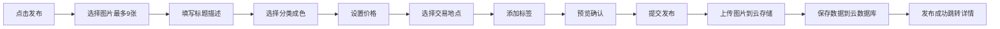
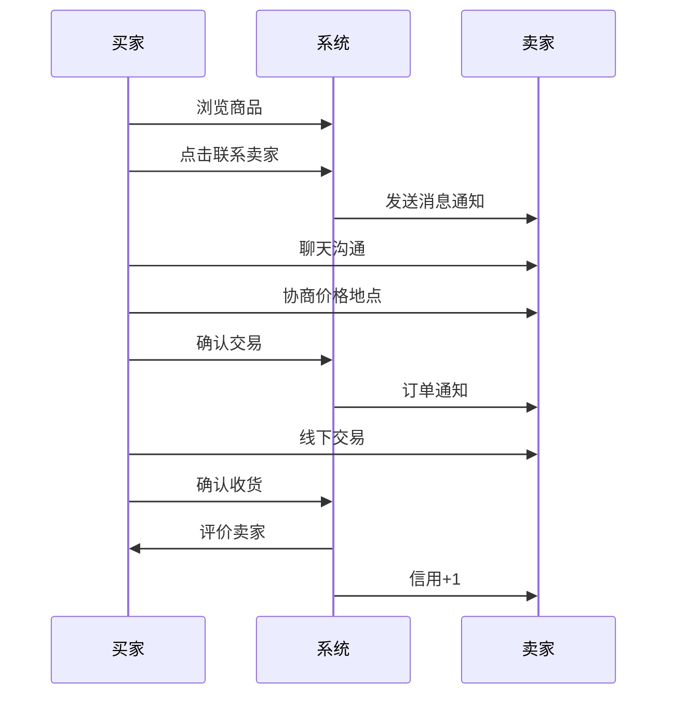

# 校园跳蚤市场 - 手机APP开发计划

> 📱 基于微信小程序的校园二手交易与任务发布平台
> 
> **项目周期：** 8周
> **目标用户：** 在校大学生  
> **核心价值：** 便捷的校园二手交易 + 限时任务互助 + 校园社区生活 + 信任社交体系

---

## 📋 目录

- [一、项目概述](#一项目概述)
- [二、技术方案](#二技术方案)
- [三、功能模块](#三功能模块)
- [四、开发计划](#四开发计划)
- [五、团队分工](#五团队分工)
- [六、环境搭建](#六环境搭建)
- [七、数据库设计](#七数据库设计)
- [八、核心功能实现](#八核心功能实现)
- [九、页面展示细节](#九页面展示细节)
- [十、测试方案](#十测试方案)
- [十一、部署上线](#十一部署上线)
- [十二、成本预算](#十二成本预算)
- [十三、风险管理](#十三风险管理)
- [附录：开发资源](#附录开发资源)

---

## 一、项目概述

### 1.1 项目背景

校园内学生需要一个便捷的平台来：
- 出售/购买二手物品（教材、数码产品、生活用品等）
- 发布/接取限时任务（代课、站岗、代会、代取快递等）
- 发布求购需求（"我想买XX"，反向匹配有货的人）
- 获取校园生活信息（建筑介绍、生活指南、学习资源）
- 分享校园动态（食堂推荐、占座情况、日常交流）

**为什么不是微信群？** 学生目前主要在微信群和朋友圈发布二手信息，但存在明显痛点：
- 信息刷屏易淹没，无法按分类/价格/时间检索
- 无法确认对方身份，交易信任成本高
- 没有订单和评价机制，纠纷难追溯
- 群覆盖范围有限，跨群发布重复低效

### 1.2 为什么选择微信小程序？

| 优势 | 说明 |
|------|------|
| **零安装成本** | 扫码即用，推广成本极低 |
| **100%覆盖率** | 所有大学生都使用微信 |
| **生态完善** | 微信支付、分享、客服、通知一应俱全 |
| **开发快速** | uni-app一套代码，多端运行 |
| **审核简单** | 比iOS/Android APP审核快3-5倍 |
| **成本低廉** | 前期云开发免费额度充足 |

### 1.3 核心特色

- **极简发布**：拍照+一口价+一句话，3步即可发布商品，比发朋友圈还快
- **校园信任体系**：学号实名认证 + 学院年级可见 + 信用评分 + 交易双确认，同校同学天然可信
- **求购广场**：不只是"我要卖"，还有"我想买"——发布求购需求，有货的人主动找你
- **快递代取专区**：校园最高频场景独立入口，3步发单，抢单式接取
- **校园动态广场**：食堂哪家好吃、图书馆有没有位置、今天有什么活动，轻量社区增加日活
- **积分激励体系**：发布、交易、评价、签到获取积分，兑换置顶曝光等权益
- **到货提醒**：关注某个分类，有新商品上架时主动推送，不错过心仪好物
- **开学季/毕业季专题**：特定时间节点集中供需，教材专场、清仓专场活动运营
- 💬 **实时聊天**：买卖双方即时沟通，交易更高效
- 📍 **校园定位**：基于校园位置的商品推荐
- 🔔 **消息推送**：新订单、新消息实时提醒
- 📖 **校园维基**：建筑导航、生活指南、学习资源一站式查阅

---

## 二、技术方案

### 2.1 整体技术架构

```
┌─────────────────────────────────────────────────────────┐
│                     微信小程序前端                          │
│                   (uni-app + Vue 3)                      │
│                                                          │
│  ┌──────────┐  ┌──────────┐  ┌──────────┐  ┌──────────┐│
│  │  首页    │  │  发布    │  │  聊天    │  │  个人    ││
│  │ 商品流   │  │  商品/   │  │  实时    │  │  中心    ││
│  │          │  │  任务    │  │  通讯    │  │          ││
│  └──────────┘  └──────────┘  └──────────┘  └──────────┘│
└─────────────────────────────────────────────────────────┘
                            ▼
┌─────────────────────────────────────────────────────────┐
│                     微信云开发                            │
│                                                          │
│  ┌──────────┐  ┌──────────┐  ┌──────────┐  ┌──────────┐│
│  │ 云数据库  │  │ 云存储   │  │ 云函数   │  │ 云调用   ││
│  │ MongoDB  │  │ 图片视频  │  │ Node.js  │  │ 小程序   ││
│  │          │  │          │  │          │  │ API      ││
│  └──────────┘  └──────────┘  └──────────┘  └──────────┘│
└─────────────────────────────────────────────────────────┘
                            ▼
┌─────────────────────────────────────────────────────────┐
│                    第三方服务                             │
│                                                          │
│  微信支付(可选)    腾讯地图(定位)    微信模板消息(通知推送) │
└─────────────────────────────────────────────────────────┘
```

### 2.2 技术栈选择

#### 前端技术
```yaml
框架: uni-app 3.x (基于 Vue 3)
  理由: 一套代码，多端运行（小程序/H5/APP）
  
UI组件库: uView UI 3.0
  理由: 专为uni-app设计，组件丰富，文档完善
  
状态管理: Pinia
  理由: Vue 3官方推荐，比Vuex更简洁
  
网络请求: uni.request + 封装
  理由: 统一管理请求拦截、错误处理
  
图片处理: uni.chooseImage + 压缩
  理由: 小程序原生API，性能最优
```

#### 后端技术
```yaml
服务: 微信云开发
  - 云数据库: MongoDB (NoSQL，灵活的数据结构)
  - 云存储: 图片、文件存储
  - 云函数: Node.js 12+
  - 云调用: 调用微信服务端API
  
理由:
  ✓ 无需购买服务器
  ✓ 免运维
  ✓ 天然鉴权
  ✓ 前期免费额度充足
```

### 2.3 开发工具

| 工具 | 用途 | 下载地址 |
|------|------|----------|
| **HBuilderX** | uni-app官方IDE | https://www.dcloud.io/hbuilderx.html |
| **微信开发者工具** | 小程序调试 | https://developers.weixin.qq.com/miniprogram/dev/devtools/download.html |
| **VS Code** | 代码编辑（可选） | https://code.visualstudio.com/ |
| **Apifox** | API测试工具 | https://apifox.com/ |

---

## 三、功能模块

### 3.1 功能架构图

```
校园跳蚤市场小程序
│
├── 🏠 首页模块
│   ├── 顶部搜索栏（固定吸顶，支持语音输入图标）
│   ├── Banner轮播（自动轮播，指示器圆点，3-5张运营位，支持活动专题跳转）
│   ├── 快捷分类导航（横向滚动图标网格：教材/数码/生活/运动/代课/代取/求购/快递...）
│   ├── 活动专题入口（开学季/考试周/毕业季等限时专题Banner，仅当有活动时展示）
│   ├── 公告通知栏（跑马灯滚动，平台公告与热门动态）
│   ├── "热门商品"推荐区（瀑布流双列卡片，图片+标题+价格+头像+认证徽章）
│   ├── "最新求购"推荐区（横向滑动卡片，求购需求+悬赏金额）
│   ├── "紧急任务"推荐区（横向滑动卡片，高亮倒计时标签）
│   ├── "校园动态"入口卡片（最新3条动态预览 + "查看更多"入口）
│   └── 回到顶部悬浮按钮（滚动超过一屏后出现）
│
├── 🛍️ 二手商品模块
│   ├── 商品列表页
│   │   ├── 顶部筛选栏（分类Tab + 排序下拉：最新/价格升降/热度）
│   │   ├── 高级筛选面板（侧滑抽屉：价格区间滑块、成色多选、交易地点选择）
│   │   ├── 瀑布流双列布局（商品卡片：封面图/标题两行截断/红色价格/原价删除线/卖家头像昵称/浏览量图标）
│   │   ├── 下拉刷新（自定义动画 + 文字提示"下拉刷新/释放刷新/正在刷新"）
│   │   ├── 上拉加载更多（底部Loading + "加载中..."/"没有更多了"状态文字）
│   │   ├── 搜索结果高亮匹配关键词
│   │   └── 空状态插画（无搜索结果时显示自定义插画 + "换个关键词试试"提示）
│   ├── 商品详情页
│   │   ├── 顶部图片轮播（全宽展示，支持手势缩放，底部圆点指示器 + "1/5"计数）
│   │   ├── 价格信息区（大号红色现价 + 删除线原价 + 折扣标签"5折"）
│   │   ├── 商品标题（加粗，最多两行）
│   │   ├── 标签区（成色标签"9成新"、分类标签"教材"、交易方式标签"当面交易"）
│   │   ├── 商品描述（可展开/收起的富文本区域，默认显示3行）
│   │   ├── 交易信息卡片（圆角卡片：交易地点带地图图标 + 发布时间 + 浏览次数 + 收藏次数）
│   │   ├── 卖家信息栏（头像 + 昵称 + "已认证"徽章 + 学院年级 + 信用星级 + 评价数 + "查看主页"按钮）
│   │   ├── "猜你喜欢"推荐区（底部同分类商品横向滚动推荐）
│   │   └── 底部操作栏（固定底部：收藏按钮含动画心跳效果 + "联系卖家"主按钮 + 分享按钮）
│   ├── 发布商品页（支持两种模式切换）
│   │   ├── 【极简模式 - 默认】仅需3步：
│   │   │   ├── ① 拍照/选图（最多9张）
│   │   │   ├── ② 一句话描述 + 一口价
│   │   │   └── ③ 选择分类 → 直接发布
│   │   ├── 【详细模式 - 可展开】完整表单：
│   │   │   ├── 图片上传区（九宫格布局，可拖拽排序，第一张标记"封面"角标）
│   │   │   ├── 标题输入框（单行，字数统计"0/30"）
│   │   │   ├── 描述输入框（多行文本域，字数统计"0/500"，placeholder示例引导）
│   │   │   ├── 分类选择器（Picker弹窗：教材/数码/生活/运动/其他）
│   │   │   ├── 成色选择（单行选项组：全新/9成新/8成新/7成新及以下）
│   │   │   ├── 价格输入（数字键盘，带"¥"前缀，可选填原价用于展示折扣）
│   │   │   ├── 交易地点选择（地图选点 或 预设校园地点列表快捷选择）
│   │   │   └── 标签输入（手动添加Tag标签，最多5个，点击×可删除）
│   │   ├── 快捷发布模板（针对高频品类预填内容）
│   │   │   ├── "教材转让"模板（预填分类=教材，成色=9成新，placeholder="书名/版本/有无笔记"）
│   │   │   ├── "数码产品"模板（预填分类=数码，placeholder="品牌/型号/购买时间/配件"）
│   │   │   └── "生活用品"模板（预填分类=生活，placeholder="物品名称/使用情况"）
│   │   ├── 预览按钮（跳转预览页查看发布效果）
│   │   └── 提交按钮（表单校验 → loading → 上传图片 → 保存数据 → 成功弹窗跳转）
│   └── 我的商品页
│       ├── Tab切换（在售中/已售出/已下架，含各状态数量角标）
│       ├── 商品操作（左滑出现"编辑"/"下架"/"删除"按钮）
│       ├── 批量管理模式（长按进入多选 → 底部操作栏：批量下架/批量删除）
│       └── 空状态提示（各Tab空状态定制插画和引导文案）
│
├── 📋 限时任务模块
│   ├── 任务大厅页
│   │   ├── 顶部快捷入口Banner（📦快递代取专区 独立高亮入口，校园最高频场景）
│   │   ├── 类型Tab（全部/代课/站岗/代会/代取快递/跑腿/其他，横向滚动）
│   │   ├── 排序选项（最新发布/报酬最高/距离最近/截止最急）
│   │   ├── 任务卡片列表（卡片内容：类型彩色标签 + 标题 + 报酬金额高亮 + 时间地点 + 倒计时"剩余2小时"）
│   │   ├── 新任务实时推送提示（"有N条新任务"浮动提示条，点击刷新）
│   │   ├── 任务紧急标记（截止时间<2小时的任务红色闪烁"紧急"标签）
│   │   ├── 下拉刷新 + 上拉加载
│   │   └── 空状态（"暂无任务，去发布一个？"按钮引导）
│   ├── 任务详情页
│   │   ├── 顶部状态栏（彩色状态标签：招募中/进行中/已完成/已取消）
│   │   ├── 任务基本信息区（类型图标 + 标题 + 详细描述展开收起）
│   │   ├── 关键信息卡片（时间含日历图标 + 地点含定位图标 + 时长 + 报酬大号金额）
│   │   ├── 要求说明区（特殊要求如"需要男生"等Tag标签展示）
│   │   ├── 发布者信息栏（头像 + 昵称 + 信用星级 + 历史发布任务数）
│   │   ├── 发布者其他任务推荐（底部横向滑动）
│   │   └── 底部操作栏（"联系发布者" + "接取任务"主按钮，已被接取则显示"任务已被接取"置灰）
│   ├── 发布任务页
│   │   ├── 任务类型选择（图标网格选择：代课/站岗/代会/代取快递/跑腿/其他）
│   │   ├── 标题输入（单行，字数限制）
│   │   ├── 详细描述（多行文本域，placeholder提供模板示例）
│   │   ├── 时间选择器（日期Picker + 时间Picker + 预计时长选择）
│   │   ├── 周期性任务开关（可设置"每周X"重复，如"每周二帮取快递"）
│   │   ├── 地点选择（地图选点 或 预设教学楼/宿舍楼快捷选择）
│   │   ├── 报酬设置（数字输入 + 可选"面议"开关）
│   │   ├── 特殊要求（多选Tag：性别要求/年级要求/其他要求自定义输入）
│   │   └── 提交按钮（校验 → 发布 → 成功跳转任务详情）
│   └── 我的任务页
│       ├── 双Tab分区（我发布的 / 我接取的）
│       ├── 我发布的子Tab（招募中/进行中/已完成，各含数量角标）
│       ├── 我接取的子Tab（进行中/已完成）
│       ├── 任务状态操作（发布者可取消/确认完成，接取者可放弃/标记完成）
│       ├── 接单者信誉展示（接单者的"靠谱帮手"标签 + 历史完成数 + 好评率）
│       └── 历史记录时间线展示
│
├── 💬 聊天模块
│   ├── 会话列表页
│   │   ├── 搜索栏（搜索联系人/消息内容）
│   │   ├── 会话项（头像含在线状态绿点 + 昵称 + 最新消息预览截断一行 + 时间戳"刚刚/5分钟前/昨天"）
│   │   ├── 未读消息红色角标（数字，99+封顶）
│   │   ├── 关联商品/任务标签（会话来源："来自商品:Java核心技术"小标签）
│   │   ├── 左滑操作（置顶/标为已读/删除会话）
│   │   ├── 置顶会话视觉区分（浅色背景高亮）
│   │   └── 空状态（"暂无消息，去逛逛商品吧"）
│   ├── 聊天详情页
│   │   ├── 顶部导航（对方昵称 + 在线状态 + 右上角"..."更多菜单：查看主页/举报）
│   │   ├── 关联商品卡片（聊天顶部固定展示关联商品缩略图+标题+价格，可点击跳转）
│   │   ├── 消息气泡区（左右对齐，发送方蓝色/接收方灰色，圆角气泡）
│   │   ├── 消息类型支持（文字消息 + 图片消息可点击放大 + 商品卡片消息 + 任务卡片消息）
│   │   ├── 时间分割线（每隔5分钟或以上显示时间标签居中）
│   │   ├── 消息状态指示（发送中转圈 + 已发送单勾 + 已读双勾）
│   │   ├── 输入区域（文字输入框 + 表情按钮 + 图片按钮 + 发送按钮变色高亮）
│   │   ├── 图片选择面板（弹出相册选择或拍照）
│   │   ├── 长按消息菜单（复制/撤回己方消息/删除）
│   │   ├── 新消息自动滚动到底部 + "有N条新消息"提示条
│   │   └── 实时更新（云数据库watch监听，消息秒达）
│   └── 消息推送
│       ├── 新消息微信服务通知（订阅消息模板）
│       ├── 订单状态变更通知
│       ├── 任务被接取/完成通知
│       └── 系统公告通知
│
├── 📖 校园维基模块
│   ├── 维基首页
│   │   ├── 顶部搜索栏（搜索建筑名/指南关键词）
│   │   ├── 分类Tab（校园建筑/生活指南/学习资源/校园活动）
│   │   ├── 热门推荐Banner（置顶3篇热门内容轮播）
│   │   ├── 内容卡片列表（封面图 + 标题 + 摘要两行 + 浏览量 + 点赞数 + 时间）
│   │   └── 用户投稿入口（右下角悬浮"我要投稿"按钮）
│   ├── 内容详情页
│   │   ├── 顶部封面大图
│   │   ├── 标题 + 作者信息（头像+昵称） + 发布时间
│   │   ├── 富文本内容展示（支持图文混排、标题层级、列表样式）
│   │   ├── 图片点击放大预览（支持左右滑动浏览多张）
│   │   ├── 底部点赞按钮（动画效果） + 收藏按钮 + 分享按钮
│   │   ├── 评论区（按时间排序，支持回复，头像+昵称+内容+时间）
│   │   └── 评论输入框（底部固定，点击展开键盘）
│   ├── 校园建筑子页
│   │   ├── 建筑列表（卡片：建筑图片 + 名称 + 简介 + 距离）
│   │   ├── 建筑详情（位置地图展示 + 开放时间 + 楼层功能介绍 + 实景照片）
│   │   └── 路线导航（一键调用地图导航）
│   └── 投稿页
│       ├── 分类选择 + 标题输入 + 富文本编辑器（插入图片/文字排版）
│       └── 提交审核流程
│
├── 🛒 求购广场模块（"我想买"反向需求）
│   ├── 求购列表页
│   │   ├── 顶部分类Tab（全部/教材/数码/生活/运动/其他）
│   │   ├── 求购卡片列表（需求描述 + 期望价格区间 + 发布者信息 + 发布时间）
│   │   ├── "我有货"按钮（直接联系求购者）
│   │   └── 下拉刷新 + 上拉加载
│   ├── 发布求购页
│   │   ├── 想买的东西描述（标题 + 详细需求）
│   │   ├── 期望价格区间（最低价~最高价 滑块 或 输入框）
│   │   ├── 分类选择
│   │   ├── 需求有效期（1天/3天/7天/长期）
│   │   └── 提交发布
│   └── 到货提醒设置
│       ├── 关注分类（选择感兴趣的商品分类）
│       ├── 关键词订阅（输入关键词，如"高数教材"）
│       └── 新商品上架时推送微信订阅消息通知
│
├── 📦 快递代取专区（高频场景独立入口）
│   ├── 代取列表（简化版任务列表，仅展示：快递站点 + 目标楼栋 + 赏金 + 倒计时）
│   ├── 快速发单（3步：选快递站点 → 选目标楼栋+取件码 → 设赏金 → 发布）
│   ├── 抢单机制（列表实时刷新，点击"我来取"立即锁定）
│   ├── 取件确认流程（取件者拍照确认取件 → 送达后双方确认 → 完成）
│   └── 快递代取排行（本月接单最多的"快递达人"排行榜）
│
├── 🏫 校园动态广场（轻社区，增加日活）
│   ├── 动态信息流
│   │   ├── 发布动态（文字+最多3张图片，限140字，类似微博短内容）
│   │   ├── 动态卡片（头像+昵称+学院标签 + 内容 + 图片 + 点赞+评论数 + 时间）
│   │   ├── 话题标签（#食堂推荐# #图书馆占座# #失物招领# #拼车回家# 等）
│   │   ├── 热门话题置顶（当日讨论最多的话题）
│   │   └── 下拉刷新 + 上拉加载
│   ├── 动态详情
│   │   ├── 完整内容展示
│   │   ├── 评论列表（支持回复）
│   │   └── 点赞动画
│   └── 发布动态页
│       ├── 文字输入（限140字）+ 图片选择（最多3张）
│       ├── 话题选择（热门话题推荐 或 自定义话题）
│       └── 发布按钮
│
├── 🏆 积分与激励体系
│   ├── 积分获取规则
│   │   ├── 每日签到（+5分，连续签到额外奖励）
│   │   ├── 发布商品（+10分/件）
│   │   ├── 完成交易（+20分/笔）
│   │   ├── 撰写评价（+5分/条）
│   │   ├── 完成任务（+15分/次）
│   │   ├── 发布校园动态（+3分/条）
│   │   └── 投稿维基内容（+30分/篇，审核通过后）
│   ├── 积分兑换
│   │   ├── 商品置顶曝光 1天（50积分）
│   │   ├── 求购需求加急推送（30积分）
│   │   ├── 专属头像框/昵称颜色（100积分）
│   │   └── 积分兑换规则说明页
│   ├── 等级体系
│   │   ├── 校园新手（0-99分）→ 校园达人（100-499分）→ 校园之星（500+分）
│   │   └── 各等级对应特权说明
│   └── 排行榜
│       ├── 月度交易达人榜（交易笔数最多）
│       ├── 好评之星榜（好评率最高）
│       ├── 热心帮手榜（完成任务最多）
│       └── 排行展示（前10名头像+昵称+数据，本人排名高亮）
│
├── 🔒 交易安全与信任体系
│   ├── 身份认证标识
│   │   ├── 学号认证通过 → 昵称旁"已认证"蓝色徽章
│   │   ├── 学院+年级标签可见（如"计算机学院 大三"）
│   │   ├── 认证用户商品排序权重更高
│   │   └── 未认证用户发布商品时引导完成认证
│   ├── 交易双确认机制
│   │   ├── 买家发起交易 → 卖家确认接受
│   │   ├── 线下见面 → 买家点击"已见面"
│   │   ├── 交易完成 → 卖家点击"已收款" + 买家点击"已收货"
│   │   └── 双方均确认后订单才标记为"已完成"，触发评价
│   ├── 举报系统
│   │   ├── 商品举报（虚假信息/违禁物品/价格欺诈）
│   │   ├── 用户举报（恶意行为/骚扰/爽约）
│   │   └── 举报处理流程（提交→审核→处理→通知结果）
│   └── 接单者信誉标签
│       ├── 完成N次任务且好评的用户 → "靠谱帮手"标签
│       └── 交易N次且零差评 → "诚信卖家"标签
│
├── 📅 活动专题模块（运营驱动）
│   ├── 开学季专题（每学期初：教材专场 + 生活用品专场 + 新生好物推荐）
│   ├── 考试周专题（考前：复习资料/历年真题交换专场）
│   ├── 毕业季专题（毕业前：大清仓专场，毕业生一键批量发布）
│   ├── 专题页展示（独立活动页：顶部Banner + 分类商品瀑布流 + 倒计时）
│   └── 专题推送（活动开始前推送订阅消息通知关注用户）
│
├── 👤 个人中心模块
│   ├── 个人主页顶部卡片
│   │   ├── 背景图 + 圆形头像（点击更换，支持裁剪）+ 认证徽章
│   │   ├── 昵称 + 学院年级标签 + 个性签名编辑
│   │   ├── 信用评分展示（星级 + 分数 + 评价总数）+ 信誉标签（"靠谱帮手"/"诚信卖家"）
│   │   ├── 等级 & 积分展示（当前等级图标 + 积分数 + 进度条到下一级）
│   │   └── 数据统计行（发布商品数 / 完成交易数 / 获得好评数）
│   ├── 功能宫格入口
│   │   ├── 我的商品（图标+文字+角标数量）
│   │   ├── 我的求购
│   │   ├── 我的任务
│   │   ├── 我的订单
│   │   ├── 我的收藏
│   │   ├── 浏览历史
│   │   ├── 我的评价
│   │   ├── 我的积分（积分明细 + 兑换入口）
│   │   └── 到货提醒（管理关注的分类和关键词订阅）
│   ├── 我的订单页
│   │   ├── Tab切换（全部/待交易/已完成/已取消）
│   │   ├── 订单卡片（商品缩略图 + 标题 + 价格 + 交易对方信息 + 状态标签）
│   │   ├── 订单详情（交易双方信息 + 商品信息 + 约定地点时间 + 操作按钮"确认收货/评价/取消"）
│   │   └── 评价弹窗（1-5星评分组件 + 文字评价输入 + 匿名评价开关）
│   ├── 我的收藏页
│   │   ├── 商品收藏列表（与商品卡片一致样式 + 失效商品灰色标记"已下架"）
│   │   └── 长按或左滑取消收藏
│   ├── 浏览历史页
│   │   ├── 按日期分组（今天/昨天/更早）
│   │   ├── 历史记录卡片
│   │   └── 一键清空历史按钮
│   ├── 设置页
│   │   ├── 个人资料编辑（头像/昵称/签名/手机号/微信号）
│   │   ├── 学号绑定/变更
│   │   ├── 消息通知开关（新消息/订单变更/任务提醒 各独立开关）
│   │   ├── 隐私设置（是否公开手机号/微信号/浏览历史）
│   │   ├── 清除缓存（显示缓存大小 + 一键清除）
│   │   ├── 意见反馈（文字+截图提交）
│   │   ├── 关于我们（版本号/用户协议/隐私政策/开源许可）
│   │   └── 退出登录（确认弹窗）
│   └── 他人主页（从卖家信息等入口进入）
│       ├── 用户基本信息（头像+昵称+信用评分+注册时间）
│       ├── 该用户在售商品列表
│       ├── 该用户收到的评价列表
│       └── 底部"发消息"按钮
│
└── 🔐 认证模块
    ├── 微信一键登录（授权弹窗 + 获取头像昵称）
    ├── 学号绑定（输入学号 + 姓名 + 学院选择 → 校验通过后绑定）
    ├── 手机号验证（获取微信绑定手机号按钮授权 或 短信验证码）
    └── 新用户引导页（3-4页滑动引导，介绍核心功能，末页"开始使用"按钮）
```

### 3.2 核心功能详细说明

#### 3.2.1 商品发布流程



#### 3.2.2 交易流程



---

## 四、开发计划

### 4.1 总体时间线（8周）

> 因新增求购广场、校园动态、积分体系、快递代取等核心吸引力功能，项目周期调整为8周。

```
Week 1: 环境搭建 + 基础框架 + 认证体系
Week 2: 核心功能开发（商品模块 + 极简发布）
Week 3: 任务模块 + 快递代取专区 + 聊天功能
Week 4: 求购广场 + 到货提醒 + 订单系统（含交易双确认）
Week 5: 校园动态广场 + 积分体系 + 排行榜
Week 6: 维基模块 + 活动专题 + 个人中心完善
Week 7: 性能优化 + 页面细节打磨 + 信任体系完善
Week 8: 全面测试 + 上线
```

### 4.2 详细开发计划

#### 📅 Week 1: 环境搭建 + 基础框架 (2.10 - 2.16)

**目标：** 搭建完整开发环境，完成项目框架

| 日期 | 任务 | 负责人 | 产出 |
|------|------|--------|------|
| **Day 1** | 注册小程序账号，开通云开发 | PM | 小程序AppID |
| | 安装开发工具 | 全员 | HBuilderX + 微信开发者工具 |
| **Day 2** | 创建uni-app项目 | 前端组 | 项目骨架 |
| | 配置uView UI | 前端组 | UI组件库集成 |
| **Day 3** | 设计数据库结构 | 后端组 | 数据库设计文档 |
| | 初始化云开发环境 | 后端组 | 云数据库+云存储 |
| **Day 4** | 完成登录页面 | 前端组 | 微信登录功能 |
| | 完成首页布局 | 前端组 | 首页框架 |
| **Day 5** | 完成底部导航 | 前端组 | Tab Bar |
| | 封装请求工具 | 后端组 | API封装 |
| **Day 6-7** | 完成商品列表页 | 前端组 | 商品展示 |
| | 测试云开发功能 | 后端组 | 云开发调试 |

**里程碑：** ✅ 可以登录，可以查看商品列表

---

#### 📅 Week 2: 核心功能开发 (2.17 - 2.23)

**目标：** 完成商品发布（极简+详细模式）和详情功能

| 日期 | 任务 | 负责人 | 产出 |
|------|------|--------|------|
| **Day 1-2** | 商品发布页（极简模式+详细模式切换+快捷模板） | 前端组 | 发布表单 |
| | 图片上传功能（压缩+排序+封面标记） | 前端组 | 图片上传组件 |
| **Day 3** | 商品详情页（含认证徽章+学院标签展示） | 前端组 | 详情展示 |
| | 商品数据接口 | 后端组 | CRUD接口 |
| **Day 4** | 分类筛选+高级筛选面板 | 前端组 | 筛选组件 |
| | 搜索功能 | 前端组 | 搜索框+接口 |
| **Day 5** | 我的商品页面（批量管理） | 前端组 | 个人商品管理 |
| | 商品状态管理 | 后端组 | 上架/下架/删除 |
| **Day 6-7** | 功能联调测试 | 全员 | Bug修复 |

**里程碑：** ✅ 可以3步极简发布商品，可以查看详情，可以搜索

---

#### 📅 Week 3: 任务模块 + 快递代取 + 聊天功能 (2.24 - 3.2)

**目标：** 完成任务大厅、快递代取专区和实时聊天

| 日期 | 任务 | 负责人 | 产出 |
|------|------|--------|------|
| **Day 1** | 任务大厅页面（含新任务实时推送提示） | 前端组 | 任务列表 |
| | 任务发布页面（含周期性任务开关） | 前端组 | 发布表单 |
| **Day 2** | 快递代取专区页面（独立入口，快速发单+抢单） | 前端组 | 代取列表+发单 |
| | 任务数据接口 | 后端组 | CRUD接口 |
| **Day 3** | 任务详情页（含接单者信誉展示） | 前端组 | 详情+接单 |
| | 代取确认流程（拍照确认+双方确认） | 后端组 | 状态流转接口 |
| **Day 4-5** | 聊天列表页+聊天详情页 | 前端组 | 会话+消息界面 |
| **Day 6** | 实时消息功能 | 后端组 | 云数据库watch |
| | 消息推送 | 后端组 | 订阅消息 |
| **Day 7** | 功能测试 | 全员 | Bug修复 |

**里程碑：** ✅ 可以发布任务+快递代取抢单，可以实时聊天

---

#### 📅 Week 4: 求购广场 + 到货提醒 + 订单系统 (3.3 - 3.9)

**目标：** 完成求购反向需求系统、到货提醒、订单交易双确认机制

| 日期 | 任务 | 负责人 | 产出 |
|------|------|--------|------|
| **Day 1** | 求购列表页+求购卡片组件 | 前端组 | 求购广场 |
| | 求购数据接口 | 后端组 | 求购CRUD+过期处理 |
| **Day 2** | 发布求购页（需求+价格区间+有效期） | 前端组 | 求购发布 |
| | 到货提醒设置页（分类订阅+关键词订阅） | 前端组 | 订阅管理 |
| **Day 3** | 新商品匹配求购云函数（上架商品时自动匹配并推送） | 后端组 | 匹配推送 |
| | 订阅消息通知接口 | 后端组 | 到货提醒推送 |
| **Day 4** | 订单系统页面（列表+详情） | 前端组 | 订单页面 |
| | 订单交易双确认逻辑（已见面→已收款→已收货） | 后端组 | 订单状态流转 |
| **Day 5** | 评价弹窗（星级+文字+匿名开关） | 前端组 | 评价功能 |
| | 信用评分算法（评价→信用分→徽章） | 后端组 | 评分接口 |
| **Day 6-7** | 功能联调测试 | 全员 | Bug修复 |

**里程碑：** ✅ 求购广场可用，到货提醒可推送，交易双确认机制完整

---

#### 📅 Week 5: 校园动态广场 + 积分体系 + 排行榜 (3.10 - 3.16)

**目标：** 完成社区动态、积分激励和排行榜，提升用户活跃留存

| 日期 | 任务 | 负责人 | 产出 |
|------|------|--------|------|
| **Day 1-2** | 校园动态信息流页面（动态卡片+话题标签+热门话题） | 前端组 | 动态广场 |
| | 发布动态页（文字+图片+话题选择） | 前端组 | 动态发布 |
| | 动态数据接口（CRUD+点赞+评论） | 后端组 | 动态接口 |
| **Day 3** | 积分中心页面（余额+明细+等级进度条） | 前端组 | 积分中心 |
| | 积分兑换页面（置顶/加急/头像框） | 前端组 | 积分兑换 |
| | 积分变动云函数（各行为触发积分结算） | 后端组 | 积分接口 |
| **Day 4** | 排行榜页面（交易达人/好评之星/热心帮手） | 前端组 | 排行榜 |
| | 每日签到逻辑（连续签到奖励） | 后端组 | 签到接口 |
| **Day 5** | 举报系统（举报弹窗+举报列表） | 前端组 | 举报功能 |
| | 举报处理云函数 | 后端组 | 举报流转接口 |
| **Day 6-7** | 功能联调测试 | 全员 | Bug修复 |

**里程碑：** ✅ 校园动态可发布可互动，积分体系运转，排行榜可查看

---

#### 📅 Week 6: 维基模块 + 活动专题 + 个人中心完善 (3.17 - 3.23)

**目标：** 完成维基、活动运营模块，完善个人中心所有功能

| 日期 | 任务 | 负责人 | 产出 |
|------|------|--------|------|
| **Day 1-2** | 校园维基首页+详情页+评论区 | 前端组 | 维基模块 |
| | 维基内容管理接口+投稿审核 | 后端组 | 维基接口 |
| **Day 3** | 活动专题页面（动态路由+Banner+倒计时+分类瀑布流） | 前端组 | 专题模块 |
| | 专题数据管理+推送配置 | 后端组 | 专题接口 |
| **Day 4** | 个人中心完善（积分/求购/徽章/等级展示） | 前端组 | 个人中心 |
| | 他人主页（商品+评价+发消息） | 前端组 | 用户主页 |
| **Day 5** | 设置页+新用户引导页+关于页 | 前端组 | 设置+引导 |
| | 消息推送模板全部配置 | 后端组 | 通知完善 |
| **Day 6-7** | 功能联调测试 | 全员 | Bug修复 |

**里程碑：** ✅ 所有功能模块开发完成

---

#### 📅 Week 7: 性能优化 + 页面细节打磨 + 信任体系完善 (3.24 - 3.30)

**目标：** 全面优化性能和交互体验，完善信任安全体系

| 日期 | 任务 | 负责人 | 产出 |
|------|------|--------|------|
| **Day 1** | 图片懒加载+列表虚拟滚动 | 前端组 | 性能优化 |
| | 本地缓存策略+请求缓存 | 前端组 | 缓存优化 |
| **Day 2** | 骨架屏+空状态+加载动画 全页面覆盖 | 前端组 | 体验完善 |
| | 页面过渡动画+收藏心跳+消息弹入 统一 | 前端组 | 动画效果 |
| **Day 3** | 认证徽章+信誉标签 全场景展示检查 | 前端组 | 信任展示 |
| | 徽章自动授予逻辑（靠谱帮手/诚信卖家条件判定） | 后端组 | 徽章逻辑 |
| **Day 4** | 首页数据聚合优化（热门商品+求购+任务+动态一次请求） | 后端组 | 首页性能 |
| | 数据库索引优化+慢查询排查 | 后端组 | 数据库优化 |
| **Day 5** | 全局细节走查（间距/字号/颜色统一性） | 前端组 | UI一致性 |
| | 错误处理统一（网络错误/空数据/超时 全覆盖） | 前端组 | 容错优化 |
| **Day 6-7** | 全面回归测试 | 全员 | 问题清单 |

**里程碑：** ✅ 性能达标，体验流畅，信任体系完整

---

#### 📅 Week 8: 全面测试 + 上线 (3.31 - 4.6)

**目标：** 全面测试，提交审核，正式上线

| 日期 | 任务 | 负责人 | 产出 |
|------|------|--------|------|
| **Day 1-2** | 功能测试（全模块） | 测试组 | 测试报告 |
| | Bug修复 | 开发组 | Bug清零 |
| **Day 3** | 兼容性测试（多机型） | 测试组 | 机型测试 |
| | 性能测试 | 测试组 | 性能报告 |
| **Day 4** | 准备审核材料 | PM | 文档+截图 |
| | 配置服务器类目 | PM | 类目申请 |
| **Day 5** | 提交审核 | PM | 审核中 |
| | 准备运营素材（首个活动专题+种子数据） | PM | 海报+文案+活动配置 |
| **Day 6-7** | 试运行（邀请种子用户） | 全员 | 收集反馈 |
| | 正式发布 | PM | 🎉上线 |

**里程碑：** ✅ 小程序正式上线

---

### 4.3 每日站会制度

**时间：** 每天早上10:00  
**时长：** 15分钟  
**形式：** 线上/线下

**分享内容：**
1. 昨天完成了什么？
2. 今天计划做什么？
3. 遇到什么问题？

---

## 五、团队分工

### 5.1 团队结构（建议7-9人）

```
项目经理 (PM) x 1
    ├── 前端开发组 x 3人
    ├── 后端开发组 x 2人
    └── 测试组 x 1-2人
```

> 由于新增求购广场、校园动态、积分体系、快递代取等模块，前端建议至少3人。

### 5.2 详细职责

#### 👨‍💼 项目经理 (1人)

**核心职责：**
- 📊 制定项目计划，把控整体进度
- 🎯 协调各组工作，解决资源冲突
- 📝 对接需求方，收集用户反馈
- 📈 每周迭代review，调整开发计划
- 🚀 负责小程序审核和发布

**工作产出：**
- 项目计划文档
- 每周进度报告
- 需求变更记录
- 审核提交材料

---

#### 💻 前端开发组 (2-3人)

**核心职责：**
- 🎨 UI界面设计与实现
- 🔧 组件开发与封装
- 📱 页面交互逻辑
- 🔌 API对接
- 🐛 前端bug修复

**技术要求：**
- 熟悉Vue.js基础
- 了解uni-app框架
- 掌握uView UI组件
- 了解微信小程序API

**工作产出：**
- 所有页面组件
- 公共组件库
- 前端工具函数
- 页面交互效果

**分工建议：**
- **前端1**：负责商品模块（列表、详情、极简发布、模板） + 求购广场
- **前端2**：负责任务模块 + 快递代取专区 + 聊天模块
- **前端3**：负责校园动态广场 + 积分体系 + 排行榜 + 个人中心 + 维基模块

---

#### ⚙️ 后端开发组 (2人)

**核心职责：**
- 🗄️ 数据库设计与优化
- 🔧 云函数开发
- 🔐 权限控制
- 📊 数据统计
- 📨 消息推送与通知

**技术要求：**
- 熟悉Node.js
- 了解MongoDB
- 掌握微信云开发
- 了解RESTful API设计

**工作产出：**
- 数据库设计文档
- 云函数代码
- 接口文档
- 消息推送配置

**分工建议：**
- **后端1**：负责数据库设计 + 核心业务云函数（商品/任务/订单/求购匹配）
- **后端2**：负责聊天系统 + 积分体系 + 消息推送 + 信用评分 + 举报处理

---

#### 🧪 测试组 (1-2人)

**核心职责：**
- 📝 编写测试用例
- 🔍 功能测试
- 📱 兼容性测试
- 🐛 Bug跟踪管理
- 📊 测试报告

**测试范围：**
- 功能完整性
- 用户体验
- 性能表现
- 机型兼容
- 异常处理

**工作产出：**
- 测试用例文档
- Bug清单
- 测试报告
- 上线检查清单

---

### 5.3 协作工具

| 工具 | 用途 | 负责人 |
|------|------|--------|
| **GitHub** | 代码托管 + 版本控制 | PM配置 |
| **Trello/飞书** | 任务管理 + 看板 | PM维护 |
| **企业微信/钉钉** | 日常沟通 | 全员 |
| **腾讯文档** | 文档协作 | 全员 |
| **Figma** | UI设计稿 | 前端组 |

---

## 六、环境搭建

### 6.1 开发环境准备

#### Step 1: 注册微信小程序

1. 访问 https://mp.weixin.qq.com/
2. 注册小程序账号（企业/个人）
3. 完成认证（学校可申请免费认证）
4. 获取 **AppID**（重要！）

#### Step 2: 安装开发工具

```bash
# 1. 下载HBuilderX
# 访问：https://www.dcloud.io/hbuilderx.html
# 选择：正式版 - Windows/Mac

# 2. 下载微信开发者工具
# 访问：https://developers.weixin.qq.com/miniprogram/dev/devtools/download.html

# 3. 安装Node.js（云函数开发需要）
# 访问：https://nodejs.org/
# 下载：LTS版本（18.x以上）

# 验证安装
node -v  # 应显示 v18.x.x
npm -v   # 应显示 9.x.x
```

#### Step 3: 开通云开发

1. 在微信开发者工具中打开小程序
2. 点击"云开发"按钮
3. 开通云开发服务
4. 获取**环境ID**（env-xxx）

---

### 6.2 创建uni-app项目

#### 方式一：HBuilderX创建（推荐）

1. 打开HBuilderX
2. 文件 → 新建 → 项目
3. 选择 `uni-app`
4. 模板选择：`uni-app` (Vue3)
5. 项目名称：`campus-market`
6. 点击创建

#### 方式二：命令行创建

```bash
# 使用官方脚手架
npx degit dcloudio/uni-preset-vue#vite campus-market
cd campus-market

# 安装依赖
npm install

# 运行到微信小程序
npm run dev:mp-weixin
```

---

### 6.3 安装uView UI

```bash
# 进入项目目录
cd campus-market

# 安装uView UI 3.0
npm install uview-plus

# 或使用HBuilderX插件市场安装
# 工具 → 插件安装 → 搜索"uView UI"
```

**配置uView**

```javascript
// main.js
import { createSSRApp } from 'vue'
import uviewPlus from 'uview-plus'

export function createApp() {
  const app = createSSRApp(App)
  
  // 使用uView UI
  app.use(uviewPlus)
  
  return { app }
}
```

```css
/* App.vue */
<style lang="scss">
  @import 'uview-plus/index.scss';
</style>
```

---

### 6.4 配置小程序AppID

```json
// manifest.json
{
  "mp-weixin": {
    "appid": "你的AppID",
    "setting": {
      "urlCheck": false
    },
    "cloudfunctionRoot": "cloudfunctions/"
  }
}
```

---

### 6.5 项目目录结构

```
campus-market/
├── pages/                          # 页面
│   ├── index/                      # 首页
│   │   └── index.vue
│   ├── login/                      # 登录
│   │   └── login.vue
│   ├── guide/                      # 新用户引导
│   │   └── index.vue
│   ├── products/                   # 商品模块
│   │   ├── list.vue               # 商品列表
│   │   ├── detail.vue             # 商品详情
│   │   └── publish.vue            # 发布商品（极简+详细模式）
│   ├── want-to-buy/               # 求购模块
│   │   ├── list.vue               # 求购列表
│   │   ├── publish.vue            # 发布求购
│   │   └── subscribe.vue          # 到货提醒设置
│   ├── tasks/                      # 任务模块
│   │   ├── list.vue               # 任务大厅
│   │   ├── detail.vue             # 任务详情
│   │   ├── publish.vue            # 发布任务
│   │   └── express.vue            # 快递代取专区
│   ├── chat/                       # 聊天模块
│   │   ├── list.vue               # 会话列表
│   │   └── detail.vue             # 聊天详情
│   ├── feeds/                      # 校园动态广场
│   │   ├── list.vue               # 动态信息流
│   │   ├── detail.vue             # 动态详情
│   │   └── publish.vue            # 发布动态
│   ├── wiki/                       # 维基模块
│   │   ├── index.vue              # 维基首页
│   │   └── detail.vue             # 内容详情
│   ├── activity/                   # 活动专题
│   │   └── topic.vue              # 专题活动页（动态路由）
│   ├── points/                     # 积分模块
│   │   ├── index.vue              # 积分中心
│   │   ├── exchange.vue           # 积分兑换
│   │   └── ranking.vue            # 排行榜
│   └── profile/                    # 个人中心
│       ├── index.vue
│       ├── my-products.vue
│       ├── my-want.vue            # 我的求购
│       ├── my-orders.vue
│       ├── my-points.vue          # 积分明细
│       ├── settings.vue           # 设置页
│       └── user-page.vue          # 他人主页
│
├── components/                     # 组件
│   ├── product-card/              # 商品卡片
│   ├── task-card/                 # 任务卡片
│   ├── want-card/                 # 求购卡片
│   ├── feed-card/                 # 动态卡片
│   ├── chat-item/                 # 聊天项
│   ├── user-badge/                # 用户认证徽章+信誉标签
│   ├── empty-state/               # 空状态（通用）
│   ├── skeleton/                  # 骨架屏（通用）
│   └── publish-template/          # 快捷发布模板选择器
│
├── static/                         # 静态资源
│   ├── images/
│   ├── icons/
│   ├── empty/                     # 空状态插画
│   └── logo.png
│
├── utils/                          # 工具函数
│   ├── request.js                 # 请求封装
│   ├── auth.js                    # 认证工具
│   ├── upload.js                  # 上传工具
│   ├── validate.js                # 验证工具
│   └── points.js                  # 积分计算工具
│
├── store/                          # 状态管理
│   ├── index.js
│   ├── user.js
│   ├── chat.js
│   └── points.js                  # 积分状态
│
├── cloudfunctions/                 # 云函数
│   ├── login/                     # 用户登录
│   ├── createOrder/               # 创建订单
│   ├── sendMessage/               # 发送消息
│   ├── updateCredit/              # 信用评分更新
│   ├── updatePoints/              # 积分变动
│   ├── matchWantToBuy/            # 求购匹配（新商品上架时匹配求购需求）
│   ├── sendNotification/          # 消息推送通知
│   └── reportHandler/             # 举报处理
│
├── uni_modules/                    # uni-app插件
│   └── uview-plus/
│
├── App.vue                         # 应用配置
├── main.js                         # 入口文件
├── manifest.json                   # 应用配置
├── pages.json                      # 页面配置
└── uni.scss                        # 全局样式
```

---

### 6.6 配置pages.json

```json
{
  "pages": [
    {
      "path": "pages/index/index",
      "style": {
        "navigationBarTitleText": "校园跳蚤市场"
      }
    },
    {
      "path": "pages/products/list",
      "style": {
        "navigationBarTitleText": "商品列表"
      }
    }
  ],
  "tabBar": {
    "color": "#999999",
    "selectedColor": "#5677fc",
    "backgroundColor": "#ffffff",
    "list": [
      {
        "pagePath": "pages/index/index",
        "text": "首页",
        "iconPath": "static/tabbar/home.png",
        "selectedIconPath": "static/tabbar/home-active.png"
      },
      {
        "pagePath": "pages/tasks/list",
        "text": "任务",
        "iconPath": "static/tabbar/task.png",
        "selectedIconPath": "static/tabbar/task-active.png"
      },
      {
        "pagePath": "pages/feeds/list",
        "text": "广场",
        "iconPath": "static/tabbar/feeds.png",
        "selectedIconPath": "static/tabbar/feeds-active.png"
      },
      {
        "pagePath": "pages/chat/list",
        "text": "消息",
        "iconPath": "static/tabbar/chat.png",
        "selectedIconPath": "static/tabbar/chat-active.png"
      },
      {
        "pagePath": "pages/profile/index",
        "text": "我的",
        "iconPath": "static/tabbar/profile.png",
        "selectedIconPath": "static/tabbar/profile-active.png"
      }
    ]
  }
}
```

---

## 七、数据库设计

### 7.1 云数据库集合（Collection）

#### 集合1: users (用户表)

```javascript
{
  "_id": "user001",                    // 自动生成
  "_openid": "oxxx",                   // 微信openid（云开发自动）
  "studentId": "2021001",              // 学号（唯一）
  "name": "张三",                       // 姓名
  "avatar": "https://...",             // 头像
  "phone": "13800138000",              // 手机号
  "wechat": "zhangsan123",             // 微信号
  "bio": "喜欢数码产品",                 // 个人简介
  "rating": 4.8,                       // 信用评分
  "ratingCount": 15,                   // 评价次数
  "schoolId": "school001",             // 学校ID
  "collegeId": "college001",           // 学院ID
  "createdAt": 1676889600000,          // 注册时间
  "updatedAt": 1676889600000           // 更新时间
}
```

**索引设计：**
```javascript
db.collection('users').createIndex({
  "studentId": 1  // 唯一索引
})
```

---

#### 集合2: products (商品表)

```javascript
{
  "_id": "prod001",
  "title": "Java核心技术（第11版）",    // 标题
  "description": "9成新，无笔记...",   // 描述
  "price": 45.00,                      // 价格
  "originalPrice": 89.00,              // 原价（可选）
  "category": "books",                 // 分类
  "condition": "9成新",                 // 成色
  "images": [                          // 图片数组
    "cloud://xxx.jpg",
    "cloud://xxx2.jpg"
  ],
  "location": "东区宿舍楼下",            // 交易地点
  "tags": ["教材", "计算机"],           // 标签
  "status": "available",               // 状态：available/reserved/sold/deleted
  "views": 128,                        // 浏览次数
  "favorites": 5,                      // 收藏次数
  "userId": "user001",                 // 卖家ID
  "userName": "张三",                   // 卖家昵称
  "userAvatar": "https://...",         // 卖家头像
  "createdAt": 1676889600000,
  "updatedAt": 1676889600000
}
```

**索引设计：**
```javascript
db.collection('products').createIndex({
  "status": 1,
  "category": 1,
  "createdAt": -1
})

db.collection('products').createIndex({
  "userId": 1,
  "status": 1
})
```

---

#### 集合3: tasks (任务表)

```javascript
{
  "_id": "task001",
  "title": "代课：高数下周二3-4节",     // 标题
  "description": "数学系，需要...",    // 描述
  "type": "代课",                      // 类型：代课/站岗/代会/代取快递等
  "reward": 20.00,                    // 报酬
  "location": "教学楼A101",            // 地点
  "time": "2024-02-20 10:00",         // 时间
  "duration": 90,                     // 时长（分钟）
  "requirements": "需要男生",          // 要求
  "status": "open",                   // 状态：open/assigned/completed/cancelled
  "userId": "user001",                // 发布者ID
  "assignedUserId": null,             // 接单者ID
  "assignedAt": null,                 // 接单时间
  "completedAt": null,                // 完成时间
  "createdAt": 1676889600000
}
```

**索引设计：**
```javascript
db.collection('tasks').createIndex({
  "status": 1,
  "type": 1,
  "createdAt": -1
})
```

---

#### 集合4: conversations (会话表)

```javascript
{
  "_id": "conv001",
  "participants": [                   // 参与者数组
    "user001",
    "user002"
  ],
  "lastMessage": {
    "content": "好的，明天见",
    "senderId": "user001",
    "createdAt": 1676889600000
  },
  "unreadCount": {                    // 未读数对象
    "user001": 0,
    "user002": 2
  },
  "relatedProduct": "prod001",        // 关联商品（可选）
  "createdAt": 1676889600000,
  "updatedAt": 1676889600000
}
```

---

#### 集合5: messages (消息表)

```javascript
{
  "_id": "msg001",
  "conversationId": "conv001",        // 会话ID
  "senderId": "user001",              // 发送者ID
  "receiverId": "user002",            // 接收者ID
  "type": "text",                     // 类型：text/image/product/task
  "content": "这个商品还在吗？",        // 内容
  "imageUrl": null,                   // 图片URL（type=image时）
  "isRead": false,                    // 是否已读
  "createdAt": 1676889600000
}
```

**索引设计：**
```javascript
db.collection('messages').createIndex({
  "conversationId": 1,
  "createdAt": -1
})
```

---

#### 集合6: orders (订单表)

```javascript
{
  "_id": "order001",
  "productId": "prod001",             // 商品ID
  "buyerId": "user002",               // 买家ID
  "sellerId": "user001",              // 卖家ID
  "price": 45.00,                     // 成交价
  "status": "pending",                // 状态：pending/completed/cancelled
  "meetingLocation": "东区宿舍楼下",   // 交易地点
  "meetingTime": "2024-02-20 15:00",  // 交易时间
  "completedAt": null,                // 完成时间
  "rating": null,                     // 评分（1-5星）
  "comment": null,                    // 评价
  "createdAt": 1676889600000
}
```

---

#### 集合7: wiki (维基内容表)

```javascript
{
  "_id": "wiki001",
  "title": "图书馆使用指南",           // 标题
  "category": "生活指南",              // 分类
  "content": "图书馆位于...",         // 内容（富文本）
  "images": ["https://..."],          // 图片
  "tags": ["图书馆", "学习"],          // 标签
  "views": 256,                       // 浏览次数
  "likes": 18,                        // 点赞数
  "authorId": "user001",              // 作者ID
  "createdAt": 1676889600000,
  "updatedAt": 1676889600000
}
```

---

#### 集合8: want_to_buy (求购表)

```javascript
{
  "_id": "want001",
  "title": "求一本高数教材",              // 标题
  "description": "同济版第七版...",       // 详细需求
  "category": "books",                   // 分类
  "priceMin": 15.00,                     // 期望最低价
  "priceMax": 30.00,                     // 期望最高价
  "status": "active",                    // 状态：active/fulfilled/expired
  "expiresAt": 1677494400000,            // 过期时间
  "userId": "user002",                   // 发布者ID
  "userName": "李四",
  "userAvatar": "https://...",
  "createdAt": 1676889600000
}
```

**索引设计：**
```javascript
db.collection('want_to_buy').createIndex({
  "status": 1,
  "category": 1,
  "createdAt": -1
})
```

---

#### 集合9: feeds (校园动态表)

```javascript
{
  "_id": "feed001",
  "content": "今天A食堂新出的麻辣香锅真不错",  // 动态内容（限140字）
  "images": ["cloud://xxx.jpg"],                // 图片（最多3张）
  "topic": "食堂推荐",                          // 话题标签
  "likes": 12,                                  // 点赞数
  "commentCount": 3,                            // 评论数
  "userId": "user001",
  "userName": "张三",
  "userAvatar": "https://...",
  "userCollege": "计算机学院",                    // 冗余学院信息
  "createdAt": 1676889600000
}
```

**索引设计：**
```javascript
db.collection('feeds').createIndex({
  "createdAt": -1
})

db.collection('feeds').createIndex({
  "topic": 1,
  "createdAt": -1
})
```

---

#### 集合10: points_log (积分流水表)

```javascript
{
  "_id": "pt001",
  "userId": "user001",                  // 用户ID
  "action": "complete_trade",           // 行为类型
  "points": 20,                         // 积分变动（正数获取，负数消耗）
  "balance": 135,                       // 变动后余额
  "description": "完成一笔交易",         // 描述
  "relatedId": "order001",              // 关联ID（可选）
  "createdAt": 1676889600000
}
```

**行为类型枚举：**
```javascript
// 获取积分
"daily_signin"      // 每日签到 +5
"publish_product"   // 发布商品 +10
"complete_trade"    // 完成交易 +20
"write_review"      // 撰写评价 +5
"complete_task"     // 完成任务 +15
"publish_feed"      // 发布动态 +3
"wiki_contribution" // 投稿维基 +30

// 消耗积分
"exchange_top"      // 兑换置顶 -50
"exchange_urgent"   // 兑换加急推送 -30
"exchange_badge"    // 兑换头像框 -100
```

---

#### 集合11: subscriptions (订阅/到货提醒表)

```javascript
{
  "_id": "sub001",
  "userId": "user001",                  // 用户ID
  "type": "category",                   // 订阅类型：category/keyword
  "value": "books",                     // 分类值 或 关键词
  "enabled": true,                      // 是否启用
  "createdAt": 1676889600000
}
```

---

#### 集合12: reports (举报表)

```javascript
{
  "_id": "rpt001",
  "reporterId": "user001",             // 举报者ID
  "targetType": "product",             // 举报目标类型：product/user/task/feed
  "targetId": "prod001",               // 举报目标ID
  "reason": "虚假信息",                 // 举报原因
  "description": "图片与实物不符...",    // 详细说明
  "images": [],                         // 举报截图
  "status": "pending",                  // 状态：pending/processing/resolved/dismissed
  "result": null,                       // 处理结果
  "createdAt": 1676889600000
}
```

---

同时需要在 **users 表** 中新增以下字段：

```javascript
// users 表新增字段
{
  // ...原有字段...
  "college": "计算机学院",               // 学院名称
  "grade": "大三",                       // 年级
  "isVerified": true,                    // 是否已完成学号认证
  "points": 135,                         // 当前积分余额
  "level": "校园达人",                    // 当前等级
  "totalTrades": 8,                      // 总交易笔数
  "totalTasks": 12,                      // 总完成任务数
  "badges": ["verified", "reliable"],    // 徽章列表：verified=已认证, reliable=靠谱帮手, honest=诚信卖家
  "signinStreak": 5,                     // 连续签到天数
  "lastSigninDate": "2024-02-20"         // 最后签到日期
}
```

---

### 7.2 数据库权限设置

```javascript
// 云开发控制台 → 数据库 → 权限设置

// users集合：仅创建者可读写
{
  "read": "doc._openid == auth.openid",
  "write": "doc._openid == auth.openid"
}

// products集合：所有人可读，仅创建者可写
{
  "read": true,
  "write": "doc._openid == auth.openid"
}

// messages集合：仅参与者可读写
{
  "read": "doc.senderId == auth.openid || doc.receiverId == auth.openid",
  "write": "doc.senderId == auth.openid"
}
```

---

## 八、核心功能实现

### 8.1 用户登录（微信授权）

```vue
<!-- pages/login/login.vue -->
<template>
  <view class="login-page">
    <view class="logo">
      <image src="/static/logo.png" mode="aspectFit" />
    </view>
    
    <view class="title">校园跳蚤市场</view>
    <view class="slogan">让闲置流动起来</view>
    
    <button 
      class="login-btn" 
      type="primary"
      @tap="handleLogin"
      :loading="loading"
    >
      <uni-icons type="weixin" color="#fff" size="20" />
      微信一键登录
    </button>
    
    <view class="tips">
      登录即代表同意《用户协议》和《隐私政策》
    </view>
  </view>
</template>

<script>
export default {
  data() {
    return {
      loading: false
    }
  },
  
  methods: {
    async handleLogin() {
      this.loading = true
      
      try {
        // 1. 获取用户信息授权
        const { userInfo } = await uni.getUserProfile({
          desc: '用于完善用户资料'
        })
        
        // 2. 调用云函数登录
        const res = await wx.cloud.callFunction({
          name: 'login',
          data: {
            userInfo
          }
        })
        
        // 3. 保存用户信息
        uni.setStorageSync('userInfo', res.result.userInfo)
        uni.setStorageSync('token', res.result.token)
        
        // 4. 判断是否需要绑定学号
        if (!res.result.userInfo.studentId) {
          uni.redirectTo({
            url: '/pages/bind-student/bind-student'
          })
        } else {
          uni.switchTab({
            url: '/pages/index/index'
          })
        }
        
      } catch (error) {
        console.error('登录失败', error)
        uni.showToast({
          title: '登录失败，请重试',
          icon: 'none'
        })
      }
      
      this.loading = false
    }
  }
}
</script>

<style lang="scss" scoped>
.login-page {
  height: 100vh;
  display: flex;
  flex-direction: column;
  align-items: center;
  justify-content: center;
  background: linear-gradient(135deg, #667eea 0%, #764ba2 100%);
  
  .logo {
    width: 200rpx;
    height: 200rpx;
    margin-bottom: 40rpx;
    
    image {
      width: 100%;
      height: 100%;
    }
  }
  
  .title {
    font-size: 48rpx;
    font-weight: bold;
    color: #fff;
    margin-bottom: 20rpx;
  }
  
  .slogan {
    font-size: 28rpx;
    color: rgba(255, 255, 255, 0.8);
    margin-bottom: 100rpx;
  }
  
  .login-btn {
    width: 600rpx;
    height: 88rpx;
    background: #fff;
    color: #5677fc;
    border-radius: 44rpx;
    font-size: 32rpx;
    display: flex;
    align-items: center;
    justify-content: center;
  }
  
  .tips {
    margin-top: 40rpx;
    font-size: 24rpx;
    color: rgba(255, 255, 255, 0.6);
  }
}
</style>
```

---

### 8.2 商品列表（瀑布流）

```vue
<!-- pages/products/list.vue -->
<template>
  <view class="products-page">
    <!-- 搜索栏 -->
    <view class="search-bar">
      <u-search 
        v-model="keyword"
        placeholder="搜索商品"
        @search="handleSearch"
        @custom="handleSearch"
      />
    </view>
    
    <!-- 分类标签 -->
    <scroll-view scroll-x class="category-scroll">
      <view 
        v-for="cat in categories" 
        :key="cat.value"
        :class="['category-item', {active: category === cat.value}]"
        @tap="selectCategory(cat.value)"
      >
        {{ cat.label }}
      </view>
    </scroll-view>
    
    <!-- 排序 -->
    <view class="filter-bar">
      <text 
        :class="['filter-item', {active: sortBy === 'time'}]"
        @tap="changeSort('time')"
      >
        最新
      </text>
      <text 
        :class="['filter-item', {active: sortBy === 'price'}]"
        @tap="changeSort('price')"
      >
        价格
      </text>
      <text 
        :class="['filter-item', {active: sortBy === 'views'}]"
        @tap="changeSort('views')"
      >
        热度
      </text>
    </view>
    
    <!-- 商品列表 - 瀑布流 -->
    <scroll-view 
      scroll-y 
      class="product-list"
      @scrolltolower="loadMore"
      :refresher-enabled="true"
      :refresher-triggered="refreshing"
      @refresherrefresh="onRefresh"
    >
      <view class="waterfall">
        <!-- 左列 -->
        <view class="column">
          <product-card 
            v-for="item in leftList" 
            :key="item._id"
            :product="item"
            @click="goDetail(item._id)"
          />
        </view>
        
        <!-- 右列 -->
        <view class="column">
          <product-card 
            v-for="item in rightList" 
            :key="item._id"
            :product="item"
            @click="goDetail(item._id)"
          />
        </view>
      </view>
      
      <!-- 加载状态 -->
      <view class="load-more">
        <text v-if="loading">加载中...</text>
        <text v-else-if="noMore">没有更多了</text>
      </view>
    </scroll-view>
    
    <!-- 发布按钮 -->
    <view class="float-btn" @tap="goPublish">
      <uni-icons type="plus" size="30" color="#fff" />
    </view>
  </view>
</template>

<script>
import ProductCard from '@/components/product-card/product-card.vue'

export default {
  components: { ProductCard },
  
  data() {
    return {
      keyword: '',
      category: 'all',
      categories: [
        {label: '全部', value: 'all'},
        {label: '教材', value: 'books'},
        {label: '数码', value: 'electronics'},
        {label: '生活', value: 'daily'},
        {label: '运动', value: 'sports'},
        {label: '其他', value: 'other'}
      ],
      sortBy: 'time',
      products: [],
      leftList: [],
      rightList: [],
      page: 1,
      pageSize: 20,
      loading: false,
      refreshing: false,
      noMore: false
    }
  },
  
  onLoad() {
    this.loadProducts()
  },
  
  methods: {
    // 加载商品列表
    async loadProducts() {
      if (this.loading || this.noMore) return
      
      this.loading = true
      
      try {
        const db = wx.cloud.database()
        const _ = db.command
        
        // 构建查询条件
        let where = {
          status: 'available'
        }
        
        // 分类筛选
        if (this.category !== 'all') {
          where.category = this.category
        }
        
        // 关键词搜索
        if (this.keyword) {
          where.title = db.RegExp({
            regexp: this.keyword,
            options: 'i'
          })
        }
        
        // 排序
        let orderBy = 'createdAt'
        let order = 'desc'
        
        if (this.sortBy === 'price') {
          orderBy = 'price'
          order = 'asc'
        } else if (this.sortBy === 'views') {
          orderBy = 'views'
          order = 'desc'
        }
        
        // 查询数据
        const { data } = await db.collection('products')
          .where(where)
          .orderBy(orderBy, order)
          .skip((this.page - 1) * this.pageSize)
          .limit(this.pageSize)
          .get()
        
        if (data.length < this.pageSize) {
          this.noMore = true
        }
        
        // 如果是第一页，重置列表
        if (this.page === 1) {
          this.products = data
          this.buildWaterfall(data)
        } else {
          this.products = [...this.products, ...data]
          this.buildWaterfall(data, true)
        }
        
      } catch (error) {
        console.error('加载失败', error)
        uni.showToast({
          title: '加载失败',
          icon: 'none'
        })
      }
      
      this.loading = false
      this.refreshing = false
    },
    
    // 构建瀑布流
    buildWaterfall(data, append = false) {
      if (!append) {
        this.leftList = []
        this.rightList = []
      }
      
      data.forEach(item => {
        // 简单实现：奇偶分配
        // 实际可根据图片高度智能分配
        if (this.leftList.length <= this.rightList.length) {
          this.leftList.push(item)
        } else {
          this.rightList.push(item)
        }
      })
    },
    
    // 下拉刷新
    onRefresh() {
      this.refreshing = true
      this.page = 1
      this.noMore = false
      this.loadProducts()
    },
    
    // 加载更多
    loadMore() {
      if (!this.loading && !this.noMore) {
        this.page++
        this.loadProducts()
      }
    },
    
    // 分类筛选
    selectCategory(value) {
      this.category = value
      this.page = 1
      this.noMore = false
      this.loadProducts()
    },
    
    // 排序
    changeSort(type) {
      this.sortBy = type
      this.page = 1
      this.noMore = false
      this.loadProducts()
    },
    
    // 搜索
    handleSearch() {
      this.page = 1
      this.noMore = false
      this.loadProducts()
    },
    
    // 跳转详情
    goDetail(id) {
      uni.navigateTo({
        url: `/pages/products/detail?id=${id}`
      })
    },
    
    // 发布商品
    goPublish() {
      uni.navigateTo({
        url: '/pages/products/publish'
      })
    }
  }
}
</script>

<style lang="scss" scoped>
.products-page {
  height: 100vh;
  display: flex;
  flex-direction: column;
  background: #f5f5f5;
}

.search-bar {
  padding: 20rpx 30rpx;
  background: #fff;
}

.category-scroll {
  white-space: nowrap;
  padding: 20rpx 30rpx;
  background: #fff;
  border-bottom: 1rpx solid #eee;
  
  .category-item {
    display: inline-block;
    padding: 12rpx 24rpx;
    margin-right: 20rpx;
    font-size: 28rpx;
    color: #666;
    background: #f5f5f5;
    border-radius: 30rpx;
    
    &.active {
      color: #fff;
      background: linear-gradient(135deg, #667eea 0%, #764ba2 100%);
    }
  }
}

.filter-bar {
  display: flex;
  padding: 24rpx 30rpx;
  background: #fff;
  border-bottom: 1rpx solid #eee;
  
  .filter-item {
    flex: 1;
    text-align: center;
    font-size: 28rpx;
    color: #666;
    
    &.active {
      color: #5677fc;
      font-weight: bold;
    }
  }
}

.product-list {
  flex: 1;
  padding: 20rpx 30rpx;
}

.waterfall {
  display: flex;
  gap: 20rpx;
  
  .column {
    flex: 1;
  }
}

.float-btn {
  position: fixed;
  right: 30rpx;
  bottom: 100rpx;
  width: 100rpx;
  height: 100rpx;
  background: linear-gradient(135deg, #667eea 0%, #764ba2 100%);
  border-radius: 50%;
  display: flex;
  align-items: center;
  justify-content: center;
  box-shadow: 0 8rpx 20rpx rgba(102, 126, 234, 0.4);
  z-index: 999;
}

.load-more {
  padding: 40rpx;
  text-align: center;
  font-size: 24rpx;
  color: #999;
}
</style>
```

---

### 8.3 商品卡片组件

```vue
<!-- components/product-card/product-card.vue -->
<template>
  <view class="product-card" @tap="handleClick">
    <!-- 商品图片 -->
    <image 
      :src="product.images[0]" 
      mode="aspectFill"
      class="cover"
      :lazy-load="true"
    />
    
    <!-- 商品信息 -->
    <view class="info">
      <view class="title">{{ product.title }}</view>
      
      <view class="price-row">
        <text class="price">¥{{ product.price }}</text>
        <text v-if="product.originalPrice" class="original-price">
          ¥{{ product.originalPrice }}
        </text>
      </view>
      
      <view class="bottom">
        <view class="user">
          <image :src="product.userAvatar" class="avatar" />
          <text class="name">{{ product.userName }}</text>
        </view>
        
        <view class="stats">
          <uni-icons type="eye" size="14" color="#999" />
          <text>{{ product.views }}</text>
        </view>
      </view>
    </view>
    
    <!-- 成色标签 -->
    <view v-if="product.condition" class="condition-tag">
      <text>{{ product.condition }}</text>
    </view>
  </view>
</template>

<script>
export default {
  props: {
    product: {
      type: Object,
      required: true
    }
  },
  
  methods: {
    handleClick() {
      this.$emit('click')
    }
  }
}
</script>

<style lang="scss" scoped>
.product-card {
  position: relative;
  background: #fff;
  border-radius: 12rpx;
  overflow: hidden;
  margin-bottom: 20rpx;
  box-shadow: 0 4rpx 12rpx rgba(0, 0, 0, 0.05);
  
  .cover {
    width: 100%;
    height: 340rpx;
    display: block;
  }
  
  .info {
    padding: 20rpx;
    
    .title {
      font-size: 28rpx;
      font-weight: 500;
      line-height: 1.4;
      display: -webkit-box;
      -webkit-line-clamp: 2;
      -webkit-box-orient: vertical;
      overflow: hidden;
      margin-bottom: 12rpx;
    }
    
    .price-row {
      display: flex;
      align-items: baseline;
      margin-bottom: 16rpx;
      
      .price {
        color: #ff4444;
        font-size: 32rpx;
        font-weight: bold;
        margin-right: 12rpx;
      }
      
      .original-price {
        color: #999;
        font-size: 24rpx;
        text-decoration: line-through;
      }
    }
    
    .bottom {
      display: flex;
      align-items: center;
      justify-content: space-between;
      
      .user {
        display: flex;
        align-items: center;
        
        .avatar {
          width: 40rpx;
          height: 40rpx;
          border-radius: 50%;
          margin-right: 12rpx;
        }
        
        .name {
          font-size: 24rpx;
          color: #666;
        }
      }
      
      .stats {
        display: flex;
        align-items: center;
        gap: 8rpx;
        font-size: 24rpx;
        color: #999;
      }
    }
  }
  
  .condition-tag {
    position: absolute;
    top: 16rpx;
    right: 16rpx;
    padding: 6rpx 16rpx;
    background: rgba(86, 119, 252, 0.85);
    backdrop-filter: blur(10rpx);
    border-radius: 20rpx;
    font-size: 20rpx;
    color: #fff;
  }
}
</style>
```

---

## 九、页面展示细节

### 9.1 全局设计规范

#### 颜色体系

| 用途 | 颜色值 | 说明 |
|------|--------|------|
| **主色** | `#5677fc` | 品牌蓝，按钮、Tab选中、链接 |
| **辅助色** | `#764ba2` | 渐变搭配色，渐变背景右侧 |
| **价格色** | `#ff4444` | 红色，商品价格、促销标签 |
| **成功色** | `#19be6b` | 绿色，成功提示、在线状态 |
| **警告色** | `#ff9900` | 橙色，紧急任务、倒计时 |
| **正文色** | `#333333` | 主要文字 |
| **次要文字** | `#666666` | 描述文字、卖家昵称 |
| **辅助文字** | `#999999` | 时间戳、浏览量、提示文字 |
| **分割线** | `#eeeeee` | 列表分割线、卡片边框 |
| **背景色** | `#f5f5f5` | 页面背景 |
| **卡片色** | `#ffffff` | 卡片、弹窗、导航栏背景 |

#### 字体规范

| 场景 | 字号 | 字重 | 示例 |
|------|------|------|------|
| 页面大标题 | 36rpx | Bold | 页面标题 |
| 商品标题 | 28-30rpx | Medium | 卡片标题、列表项 |
| 价格 | 32-36rpx | Bold | ¥45.00 |
| 正文 | 28rpx | Regular | 商品描述 |
| 辅助信息 | 24rpx | Regular | 时间、浏览量 |
| 标签文字 | 22rpx | Regular | 成色标签、分类标签 |
| 角标数字 | 20rpx | Bold | 未读消息数 |

#### 间距规范

```
页面内边距：30rpx
卡片内边距：20-24rpx
卡片间距：20rpx
列表项间距：16rpx
图标与文字间距：8-12rpx
```

#### 圆角规范

```
大圆角（卡片/弹窗）：16-20rpx
中圆角（按钮/输入框）：12rpx
小圆角（标签）：8rpx
全圆角（头像/角标）：50%
```

### 9.2 通用组件展示规范

#### 骨架屏加载

每个列表页在数据加载完成前展示骨架屏：
- 商品列表：两列灰色矩形块（模拟图片）+ 短灰色条（模拟文字）
- 任务列表：全宽灰色卡片块
- 聊天列表：圆形灰块（头像）+ 两行灰色条
- 维基列表：左侧方形灰块 + 右侧三行灰色条

```
骨架屏动画：从左到右渐变光影扫过效果
持续时间：直到数据返回
超时处理：5秒未返回显示"加载失败，点击重试"
```

#### 下拉刷新

```
状态1（下拉中）：顶部显示 ↓ 图标 + "下拉刷新"
状态2（释放刷新）：顶部显示 ↑ 图标 + "释放立即刷新"
状态3（刷新中）：顶部显示旋转Loading + "正在刷新..."
状态4（完成）：显示 ✓ + "刷新成功" → 0.5秒后收起
```

#### 空状态页

| 页面 | 插画 | 文案 | 引导按钮 |
|------|------|------|----------|
| 商品列表（无结果） | 搜索放大镜插画 | "没有找到相关商品" | "换个关键词试试" |
| 我的商品（无在售） | 空货架插画 | "还没有发布商品" | "去发布一个" |
| 任务大厅（无任务） | 空白文件插画 | "暂时没有任务" | "去发布任务" |
| 聊天列表（无消息） | 信封插画 | "暂无消息" | "去逛逛商品" |
| 收藏列表（无收藏） | 空心星星插画 | "还没有收藏内容" | "去发现好物" |
| 浏览历史（无记录） | 时钟插画 | "还没有浏览记录" | "去首页看看" |
| 我的订单（无订单） | 空购物车插画 | "暂无订单" | "去逛逛" |
| 网络错误 | 断网插画 | "网络不给力" | "点击重试" |

#### Toast / 弹窗规范

```
成功Toast：绿色对勾图标 + 文字，1.5秒自动消失，居中显示
失败Toast：红色叉号图标 + 文字，1.5秒自动消失
操作确认弹窗：居中白色卡片，标题+描述+取消/确认双按钮
底部操作面板：底部滑出白色面板，操作项列表+取消按钮
```

### 9.3 首页展示细节

```
┌──────────────────────────────┐
│  🔍 搜索教材、数码、生活用品...  │  ← 灰色搜索栏，点击跳转搜索页
├──────────────────────────────┤
│  ┌────────────────────────┐  │
│  │     Banner轮播图        │  │  ← 高度320rpx，自动轮播3秒/张
│  │    3-5张运营位图片       │  │     圆角16rpx，底部圆点指示器
│  └────────────────────────┘  │
├──────────────────────────────┤
│  📢 欢迎使用校园跳蚤市场...    │  ← 跑马灯公告栏，高度60rpx
├──────────────────────────────┤
│  📚   💻   🏠   ⚽   📋   📦 │  ← 分类图标网格：两排，可横向滚动
│  教材  数码  生活  运动  代课  跑腿│     每个图标48rpx，文字22rpx
├──────────────────────────────┤
│  热门商品            查看更多 > │  ← 区域标题，右侧"查看更多"链接
│  ┌──────┐ ┌──────┐           │
│  │ 图片  │ │ 图片  │           │  ← 瀑布流双列卡片
│  │ 标题  │ │ 标题  │           │     卡片圆角12rpx
│  │ ¥45  │ │ ¥89  │           │     卡片阴影 0 4rpx 12rpx rgba(0,0,0,0.05)
│  │ 👤张三│ │ 👤李四│           │
│  └──────┘ └──────┘           │
│  ┌──────┐ ┌──────┐           │
│  │      │ │      │           │
│  │ ...  │ │ ...  │           │
│  └──────┘ └──────┘           │
├──────────────────────────────┤
│  紧急任务            查看更多 > │  ← 任务推荐区域
│  ┌─────────┐ ┌─────────┐     │  ← 横向滚动卡片
│  │ 代课     │ │ 取快递   │     │     橙色"紧急"标签 + 倒计时
│  │ ¥20/次  │ │ ¥5/次   │     │     卡片宽度280rpx
│  │ 剩余2h  │ │ 剩余30m │     │
│  └─────────┘ └─────────┘     │
└──────────────────────────────┘
```

### 9.4 商品详情页展示细节

```
┌──────────────────────────────┐
│  ┌────────────────────────┐  │
│  │                        │  │  ← 全宽图片轮播，高度750rpx
│  │    商品图片轮播          │  │     支持手势左右滑动
│  │                        │  │     支持双指缩放预览
│  │                 1/5    │  │  ← 右下角页码指示器
│  └────────────────────────┘  │
├──────────────────────────────┤
│  ¥45.00        原价 ¥89.00  │  ← 价格区：现价36rpx红色加粗
│                    5折       │     原价24rpx灰色删除线，折扣橙色标签
├──────────────────────────────┤
│  Java核心技术（第11版）       │  ← 标题区：30rpx，加粗，最多2行
│                              │
│  ┌─────┐ ┌─────┐ ┌──────┐  │  ← 标签区：圆角标签
│  │9成新 │ │教材  │ │当面交易│  │     背景色#f0f4ff，文字色#5677fc
│  └─────┘ └─────┘ └──────┘  │
├──────────────────────────────┤
│  这本书买来基本没翻过，里面   │  ← 描述区：28rpx #666，默认3行
│  没有笔记标注，非常适合...   │     "展开" / "收起"按钮
│  展开 ∨                      │
├──────────────────────────────┤
│  ┌────────────────────────┐  │
│  │ 📍 东区宿舍楼下         │  │  ← 交易信息卡片：圆角背景#f8f8f8
│  │ 🕐 发布于 2小时前       │  │
│  │ 👁 128次浏览  ❤ 5人收藏 │  │
│  └────────────────────────┘  │
├──────────────────────────────┤
│  ┌──┐                       │
│  │头│ 张三  ⭐4.8 (15条评价) │  ← 卖家信息栏：头像64rpx圆形
│  │像│           查看主页 >  │     点击头像或"查看主页"跳转
│  └──┘                       │
├──────────────────────────────┤
│  猜你喜欢                    │  ← 底部推荐：同分类商品
│  ┌────┐ ┌────┐ ┌────┐      │     横向滚动，卡片200rpx宽
│  │    │ │    │ │    │      │
│  │¥25 │ │¥60 │ │¥15 │      │
│  └────┘ └────┘ └────┘      │
├──────────────────────────────┤
│  ❤收藏    💬联系卖家     📤  │  ← 固定底部操作栏
│           (主按钮蓝色)       │     收藏：点击心跳动画变红
└──────────────────────────────┘     联系卖家：跳转聊天并附带商品卡片
```

### 9.5 商品发布页展示细节

```
┌──────────────────────────────┐
│  发布商品                  ×  │  ← 导航栏：左上"×"关闭
├──────────────────────────────┤
│  ┌────┐ ┌────┐ ┌────┐      │
│  │ +  │ │img │ │img │  ... │  ← 图片上传区：九宫格
│  │添加 │ │封面 │ │    │      │     第一张显示"封面"角标
│  │图片 │ │    │ │    │      │     "+"号添加按钮虚线边框
│  └────┘ └────┘ └────┘      │     最多9张，长按可拖拽排序
│                    已选 2/9  │     底部计数文字
├──────────────────────────────┤
│  标题                  0/30  │  ← 输入框带字数统计
│  ┌────────────────────────┐  │     placeholder: "描述商品核心卖点"
│  │                        │  │
│  └────────────────────────┘  │
├──────────────────────────────┤
│  商品描述              0/500  │  ← 多行文本域
│  ┌────────────────────────┐  │     placeholder提供模板引导：
│  │                        │  │     "品牌/型号：\n购买时间：\n
│  │                        │  │      使用情况：\n转手原因："
│  │                        │  │     最小高度200rpx
│  └────────────────────────┘  │
├──────────────────────────────┤
│  商品分类              教材 > │  ← Picker选择器
│  商品成色            9成新 > │  ← 单行选项组，选中高亮
│  售价              ¥ [    ] │  ← 数字键盘
│  原价（选填）       ¥ [    ] │  ← 用于展示折扣
│  交易地点        东区楼下 >  │  ← 地图选点或预设地点列表
├──────────────────────────────┤
│  添加标签                    │
│  ┌────┐ ┌──────┐ ┌────┐    │  ← 已添加标签，可点×删除
│  │教材×│ │计算机×│ │    │    │     "+"按钮添加新标签
│  └────┘ └──────┘ └────┘    │     最多5个
├──────────────────────────────┤
│                              │
│  ┌────────────────────────┐  │
│  │       预 览 发 布       │  │  ← 双按钮：预览(白底) + 发布(蓝底)
│  └────────────────────────┘  │     发布前表单校验，必填项未填红框提示
│  ┌────────────────────────┐  │
│  │       确 认 发 布       │  │
│  └────────────────────────┘  │
└──────────────────────────────┘
```

### 9.6 聊天详情页展示细节

```
┌──────────────────────────────┐
│  < 张三         在线  ···    │  ← 导航栏：返回+对方昵称+在线状态+更多菜单
├──────────────────────────────┤
│  ┌────────────────────────┐  │
│  │ 📦 Java核心技术  ¥45   │  │  ← 关联商品卡片：灰色底，可点击跳转
│  └────────────────────────┘  │     缩略图40rpx + 标题 + 价格
├──────────────────────────────┤
│                              │
│       ── 今天 14:30 ──       │  ← 时间分割线：灰色居中
│                              │
│  ┌──┐ ┌──────────────┐      │
│  │头│ │这个商品还在吗？│      │  ← 对方消息：灰色气泡靠左
│  │像│ └──────────────┘      │     头像36rpx圆形
│  └──┘                       │
│                              │
│        ┌──────────────┐ ┌──┐│
│        │在的，要看看吗  │ │头││  ← 我方消息：蓝色气泡靠右
│        └──────────────┘ │像││     白色文字
│                    ✓已读  └──┘│  ← 消息状态：蓝色小字
│                              │
│  ┌──┐ ┌──────────────┐      │
│  │头│ │  [图片消息]    │      │  ← 图片消息：圆角缩略图
│  │像│ │  点击查看大图   │      │     最大宽度400rpx
│  └──┘ └──────────────┘      │     点击全屏预览，支持缩放
│                              │
│       ── 14:35 ──            │
│                              │
│        ┌──────────────┐ ┌──┐│
│        │可以，在哪碰面？ │ │头││
│        └──────────────┘ │像││
│                 发送中... └──┘│  ← 发送状态：灰色转圈图标
│                              │
├──────────────────────────────┤
│  ┌────────────────┐ 😊 📷 📤│  ← 输入区域固定底部
│  │ 输入消息...     │          │     输入框圆角12rpx
│  └────────────────┘          │     有文字时发送按钮变蓝色高亮
└──────────────────────────────┘
```

### 9.7 任务卡片展示细节

```
┌──────────────────────────────┐
│  ┌─────┐                     │
│  │ 代课 │   高数代课 3-4节    │  ← 类型标签彩色 + 标题加粗
│  └─────┘                     │     代课=蓝色 站岗=绿色 代取=橙色
│                              │
│  📍 教学楼A101               │  ← 地点信息，灰色图标+文字
│  🕐 明天 10:00-11:30         │  ← 时间信息
│                              │
│  💰 ¥20           ⏰ 剩余2h  │  ← 左：报酬金额红色加粗
│                              │     右：倒计时橙色（<2h红色闪烁）
│  ┌──┐                       │
│  │头│ 李四  ⭐4.5            │  ← 发布者信息
│  └──┘                       │
└──────────────────────────────┘
```

### 9.8 个人中心页展示细节

```
┌──────────────────────────────┐
│  ┌────────────────────────┐  │
│  │   渐变背景 (蓝→紫)     │  │  ← 顶部卡片：渐变背景
│  │     ┌────┐             │  │
│  │     │头像│             │  │  ← 头像：100rpx，白色边框
│  │     └────┘             │  │     点击弹出"拍照/相册"
│  │     张三                │  │  ← 昵称：白色，32rpx，加粗
│  │     让闲置流动起来       │  │  ← 签名：白色半透明，24rpx
│  │                        │  │
│  │   ⭐4.8分  15条评价     │  │  ← 信用分：星级+分数+评价数
│  │                        │  │
│  │  发布12  交易8   好评8  │  │  ← 数据统计：三列均分白色文字
│  │  件商品   次     次     │  │
│  └────────────────────────┘  │
├──────────────────────────────┤
│  ┌──────┐ ┌──────┐ ┌──────┐ │
│  │🛍️    │ │📋    │ │📦    │ │  ← 功能宫格：3列×2行
│  │我的商品│ │我的任务│ │我的订单│ │     每格带图标+文字+角标
│  └──────┘ └──────┘ └──────┘ │
│  ┌──────┐ ┌──────┐ ┌──────┐ │
│  │❤️    │ │🕐    │ │⭐    │ │
│  │我的收藏│ │浏览历史│ │我的评价│ │
│  └──────┘ └──────┘ └──────┘ │
├──────────────────────────────┤
│  📝 意见反馈              >  │  ← Cell列表项：左图标+文字+右箭头
│  ⚙️ 设置                 >  │
│  ℹ️ 关于我们              >  │
└──────────────────────────────┘
```

### 9.9 页面过渡与动画规范

| 场景 | 动画效果 | 时长 |
|------|----------|------|
| 页面跳转 | 右侧滑入 | 300ms |
| 页面返回 | 左侧滑出 | 300ms |
| 弹窗出现 | 底部滑入 + 背景渐暗 | 250ms |
| 弹窗关闭 | 底部滑出 + 背景渐亮 | 200ms |
| 列表项出现 | 淡入 + 微上滑 | 200ms（逐项延迟50ms）|
| 收藏心跳 | 缩放心跳 0.8→1.2→1.0 | 400ms |
| Tab切换 | 内容淡入淡出 | 200ms |
| 下拉刷新 | 顶部弹性回弹 | 300ms |
| 骨架屏光影 | 从左到右渐变扫过 | 1.5s 循环 |
| 消息发送 | 气泡从底部弹入 | 200ms |
| 图片预览 | 点击位置放大展开 | 300ms |
| 按钮点击 | 微缩放0.95 | 100ms |
| 签到成功 | 积分数字跳动 +5 飘出 | 500ms |
| 抢单成功 | 全屏撒花 + "抢单成功" | 800ms |

### 9.10 求购广场页展示细节

```
┌──────────────────────────────┐
│  求购广场             发布求购 │  ← 导航栏：右侧"发布求购"按钮
├──────────────────────────────┤
│  全部  教材  数码  生活  运动  │  ← 分类Tab横向滚动
├──────────────────────────────┤
│  ┌────────────────────────┐  │
│  │ 🔍 求一本高数教材       │  │  ← 求购卡片：白底圆角卡片
│  │                        │  │
│  │ 同济版第七版，最好没有   │  │  ← 需求描述，最多2行截断
│  │ 笔记标注...             │  │
│  │                        │  │
│  │ 期望价格：¥15 ~ ¥30    │  │  ← 绿色价格区间
│  │                        │  │
│  │ ┌──┐ 李四  计算机 大二  │  │  ← 发布者：头像+昵称+学院年级
│  │ │头│     3天前 · 剩余4天│  │  ← 发布时间+有效期倒计时
│  │ └──┘                   │  │
│  │              [我有货 📦] │  │  ← 右下角"我有货"按钮
│  │                        │  │     点击→打开聊天并附带求购卡片
│  └────────────────────────┘  │
│                              │
│  ┌────────────────────────┐  │
│  │ 🔍 求一个蓝牙耳机       │  │
│  │ ...                    │  │
│  └────────────────────────┘  │
├──────────────────────────────┤
│  过期求购灰色显示"已过期"标签  │
└──────────────────────────────┘
```

### 9.11 快递代取专区展示细节

```
┌──────────────────────────────┐
│  📦 快递代取            我要发单│  ← 导航栏
├──────────────────────────────┤
│  🏆 本月快递达人：小王(32单)  │  ← 顶部排行小横幅，点击查看排行榜
├──────────────────────────────┤
│  ┌────────────────────────┐  │
│  │ 菜鸟驿站 → 7号楼       │  │  ← 代取卡片：起点→终点 大字显示
│  │                        │  │
│  │ 取件码：12-3-4567      │  │  ← 取件码（接单后可见，接单前隐藏）
│  │ 💰 ¥3             ⏰5m │  │  ← 左：赏金红色  右：发布时间
│  │                        │  │
│  │ ┌──┐ 张三  已认证✓     │  │
│  │ │头│                   │  │
│  │ └──┘    [我来取 🏃]    │  │  ← "我来取"按钮橙色高亮
│  └────────────────────────┘  │     点击后立即锁定，弹出确认
│                              │
│  ┌────────────────────────┐  │
│  │ 京东快递柜 → 3号楼     │  │
│  │ 💰 ¥5             ⏰2m │  │
│  │         [已被接取 ✓]   │  │  ← 已被接取的显示灰色状态
│  └────────────────────────┘  │
└──────────────────────────────┘

快速发单弹窗（3步）：
┌──────────────────────────────┐
│  发布代取任务                  │
├──────────────────────────────┤
│  ① 快递在哪？                │
│  ┌─────┐ ┌──────┐ ┌──────┐ │  ← 预设快递站点快捷选择
│  │菜鸟  │ │京东柜 │ │顺丰点 │ │
│  └─────┘ └──────┘ └──────┘ │
│                              │
│  ② 送到哪？         取件码   │
│  ┌─────┐            ┌────┐  │
│  │7号楼│            │    │  │  ← 楼栋选择 + 取件码输入
│  └─────┘            └────┘  │
│                              │
│  ③ 赏金 ¥ [3]              │  ← 默认¥3，可修改
│                              │
│  ┌────────────────────────┐  │
│  │       立即发布          │  │
│  └────────────────────────┘  │
└──────────────────────────────┘
```

### 9.12 校园动态广场展示细节

```
┌──────────────────────────────┐
│  校园动态                  ✏️ │  ← 右上角发布按钮
├──────────────────────────────┤
│  🔥 热门话题                  │
│  #食堂推荐 #失物招领 #拼车   │  ← 热门话题标签横向滚动
│   #图书馆  #考试交流          │     点击进入话题页
├──────────────────────────────┤
│  ┌────────────────────────┐  │
│  │ ┌──┐ 张三              │  │
│  │ │头│ 计算机学院·大三    │  │  ← 学院年级标签灰色小字
│  │ └──┘            2小时前 │  │
│  │                        │  │
│  │ 今天A食堂新出的麻辣香锅 │  │  ← 动态正文，最多4行
│  │ 真不错，推荐大家去试试  │  │
│  │                        │  │
│  │ ┌──────┐               │  │  ← 图片：1张满宽，2张并排
│  │ │ 图片  │               │  │          3张九宫格
│  │ └──────┘               │  │
│  │                        │  │
│  │ #食堂推荐              │  │  ← 话题标签蓝色
│  │                        │  │
│  │ ❤ 12   💬 3            │  │  ← 点赞+评论互动栏
│  └────────────────────────┘  │
│                              │
│  ┌────────────────────────┐  │
│  │ ┌──┐ 李四              │  │
│  │ │头│ 电气学院·大一      │  │
│  │ └──┘                   │  │
│  │ 有人在图书馆三楼捡到一  │  │
│  │ 个U盘吗？黑色的...     │  │
│  │                        │  │
│  │ #失物招领              │  │
│  │ ❤ 5   💬 8             │  │
│  └────────────────────────┘  │
└──────────────────────────────┘
```

### 9.13 积分中心页展示细节

```
┌──────────────────────────────┐
│  积分中心                     │
├──────────────────────────────┤
│  ┌────────────────────────┐  │
│  │  渐变背景（蓝→紫）      │  │
│  │                        │  │
│  │  当前积分               │  │
│  │     135               │  │  ← 大号白色数字，48rpx
│  │                        │  │
│  │  校园达人  ████████░░  │  │  ← 等级名+进度条（到下一级）
│  │  距离校园之星还需365分  │  │
│  │                        │  │
│  │  [每日签到✅]  已连续5天 │  │  ← 签到按钮（已签到变灰+对勾）
│  └────────────────────────┘  │
├──────────────────────────────┤
│  赚积分                      │
│  ┌──────┐ ┌──────┐ ┌──────┐│
│  │发商品 │ │做任务 │ │写评价 ││  ← 赚积分方式图标入口
│  │+10   │ │+15   │ │+5   ││
│  └──────┘ └──────┘ └──────┘│
├──────────────────────────────┤
│  积分兑换                > │
│  ┌──────┐ ┌──────┐ ┌──────┐│
│  │置顶1天│ │加急推送│ │头像框 ││  ← 兑换商品横向滚动
│  │50积分 │ │30积分 │ │100分 ││
│  └──────┘ └──────┘ └──────┘│
├──────────────────────────────┤
│  积分明细                    │
│  + 完成交易          +20  今天│  ← 明细列表
│  + 发布商品          +10  今天│     正数绿色，负数红色
│  - 兑换置顶          -50  昨天│
│  + 每日签到          +5   昨天│
│  ...                        │
└──────────────────────────────┘
```

### 9.14 排行榜页展示细节

```
┌──────────────────────────────┐
│  排行榜                       │
├──────────────────────────────┤
│  交易达人  好评之星  热心帮手  │  ← 三个榜单Tab切换
├──────────────────────────────┤
│  ┌────────────────────────┐  │
│  │ 🥇  ┌──┐ 小王          │  │  ← 前三名：金银铜图标+大头像
│  │      │头│ 计算机·大三   │  │
│  │      └──┘ 本月交易28笔  │  │
│  │                        │  │
│  │ 🥈  ┌──┐ 小李          │  │
│  │      │头│ 电气·大二     │  │
│  │      └──┘ 本月交易22笔  │  │
│  │                        │  │
│  │ 🥉  ┌──┐ 小张          │  │
│  │      │头│ 外语·大四     │  │
│  │      └──┘ 本月交易18笔  │  │
│  └────────────────────────┘  │
├──────────────────────────────┤
│  4  头像  小赵  15笔         │  ← 第4-10名列表
│  5  头像  小陈  12笔         │
│  ...                        │
├──────────────────────────────┤
│  ┌────────────────────────┐  │
│  │ 你的排名：第 23 名       │  │  ← 底部固定：本人排名高亮
│  │ 本月交易 5 笔            │  │     蓝色背景卡片
│  └────────────────────────┘  │
└──────────────────────────────┘
```

---

## 十、测试方案

### 10.1 功能测试清单

#### ✅ 用户与认证模块
- [ ] 微信登录正常
- [ ] 学号绑定功能
- [ ] 学院+年级标签展示正确
- [ ] "已认证"徽章显示
- [ ] 个人信息修改
- [ ] 头像上传+裁剪
- [ ] 新用户引导页流程

#### ✅ 商品模块
- [ ] 商品列表展示（瀑布流+认证徽章）
- [ ] 分类筛选+高级筛选面板
- [ ] 关键词搜索+结果高亮
- [ ] 价格/热度排序
- [ ] 商品详情（图片缩放+描述展开收起+卖家信息+推荐）
- [ ] 极简模式发布（3步完成）
- [ ] 详细模式发布
- [ ] 快捷发布模板（教材/数码/生活）
- [ ] 图片上传（多张+拖拽排序+封面标记）
- [ ] 商品编辑/下架/删除
- [ ] 批量管理模式

#### ✅ 求购模块
- [ ] 求购列表展示
- [ ] 发布求购（需求+价格区间+有效期）
- [ ] "我有货"联系求购者
- [ ] 到货提醒设置（分类订阅+关键词订阅）
- [ ] 新商品上架匹配求购并推送通知
- [ ] 求购过期自动处理

#### ✅ 任务模块
- [ ] 任务列表（含新任务实时推送提示）
- [ ] 任务筛选+排序
- [ ] 发布任务（含周期性任务）
- [ ] 接单功能（含信誉展示）
- [ ] 任务完成确认
- [ ] 快递代取专区（快速发单+抢单+拍照确认+双方确认）
- [ ] 快递代取排行

#### ✅ 聊天模块
- [ ] 会话列表（关联商品标签+置顶+左滑操作）
- [ ] 实时消息
- [ ] 发送文字+图片+商品卡片+任务卡片
- [ ] 消息状态（发送中/已发送/已读）
- [ ] 未读角标
- [ ] 消息推送

#### ✅ 校园动态模块
- [ ] 动态信息流展示
- [ ] 发布动态（文字+图片+话题）
- [ ] 热门话题展示
- [ ] 动态点赞+评论+回复
- [ ] 动态详情页

#### ✅ 积分与激励模块
- [ ] 每日签到（连续签到奖励）
- [ ] 各行为积分自动结算（发布/交易/评价/任务/动态/投稿）
- [ ] 积分明细展示
- [ ] 积分兑换功能
- [ ] 等级展示+进度条
- [ ] 排行榜（三个榜单+本人排名高亮）

#### ✅ 交易安全模块
- [ ] 交易双确认流程（已见面→已收款→已收货）
- [ ] 信誉标签自动授予（靠谱帮手/诚信卖家）
- [ ] 举报提交（商品/用户/任务/动态）
- [ ] 举报状态查看

#### ✅ 订单模块
- [ ] 创建订单
- [ ] 订单列表（含双确认状态展示）
- [ ] 订单详情
- [ ] 确认收货（双确认）
- [ ] 评价功能（星级+文字+匿名）

#### ✅ 维基+专题模块
- [ ] 维基首页+分类+搜索
- [ ] 内容详情（富文本+评论）
- [ ] 用户投稿
- [ ] 活动专题页展示
- [ ] 专题推送通知

---

### 10.2 性能测试

| 测试项 | 标准 | 实际 | 状态 |
|--------|------|------|------|
| 首页加载时间 | <2s | | ⏳ |
| 商品列表加载 | <1s | | ⏳ |
| 图片上传时间（单张） | <3s | | ⏳ |
| 商品详情加载 | <1s | | ⏳ |
| 聊天消息延迟 | <500ms | | ⏳ |
| 页面切换动画 | <300ms | | ⏳ |
| 搜索响应时间 | <1s | | ⏳ |

---

### 10.3 兼容性测试

**测试机型清单：**
- [ ] iPhone 14 Pro (iOS 17)
- [ ] iPhone 11 (iOS 16)
- [ ] 小米13 (Android 13)
- [ ] 华为Mate 40 (HarmonyOS)
- [ ] OPPO Reno (Android 12)

**测试内容：**
- 页面布局
- 图片显示
- 按钮点击
- 输入功能
- 相机调用
- 地理定位

---

## 十一、部署上线

### 11.1 上线前检查清单

#### 📋 代码检查
- [ ] 移除所有console.log
- [ ] 移除测试代码和mock数据
- [ ] 检查数据库权限配置
- [ ] 优化图片资源（压缩静态图片）
- [ ] 检查页面骨架屏和加载状态完整性

#### 📋 功能检查
- [ ] 所有功能正常
- [ ] 无明显bug
- [ ] 性能达标
- [ ] 兼容性良好

#### 📋 内容检查
- [ ] 删除测试数据
- [ ] 准备示例商品
- [ ] 准备用户协议
- [ ] 准备隐私政策

---

### 11.2 提交审核

#### Step 1: 配置服务器域名

1. 登录微信公众平台
2. 开发 → 开发管理 → 开发设置
3. 配置服务器域名：
   - request合法域名：云开发域名
   - uploadFile合法域名：云开发域名
   - downloadFile合法域名：云开发域名

#### Step 2: 配置小程序类目

1. 设置 → 基本设置 → 服务类目
2. 添加类目：
   - 一级类目：教育
   - 二级类目：在线教育
   - 或：社交 → 社区/论坛

#### Step 3: 上传代码

```bash
# 在微信开发者工具中
1. 点击"上传"按钮
2. 填写版本号：v1.0.0
3. 填写项目备注：首次发布
4. 点击上传
```

#### Step 4: 提交审核

1. 登录微信公众平台
2. 版本管理 → 开发版本
3. 点击"提交审核"
4. 填写审核信息：
   - 功能页面：首页路径
   - 标题：校园跳蚤市场
   - 功能描述：详细描述功能
   - 测试账号：提供测试学号
5. 提交审核

#### Step 5: 发布上线

- 审核通过后（通常1-3天）
- 点击"发布"按钮
- 🎉 正式上线！

---

### 11.3 运营准备

#### 推广素材

```
海报文案：
📢 校园跳蚤市场小程序正式上线！
💰 闲置物品秒变零花钱
📚 教材低价转让，省钱又环保
🤝 限时任务发布，兼职赚外快
📱 扫码即用，无需下载

操作步骤：
1. 微信扫码打开小程序
2. 一键登录，绑定学号
3. 发布商品/任务
4. 线上沟通，线下交易
```

#### 推广渠道

1. **线上渠道**
   - 班级群、院系群
   - 朋友圈、QQ空间
   - 校园公众号合作
   - 学生组织推广

2. **线下渠道**
   - 宿舍楼海报
   - 食堂宣传台
   - 图书馆传单
   - 社团活动推广

---

## 十二、成本预算

### 12.1 初期成本（第1年）

| 项目 | 费用 | 说明 |
|------|------|------|
| **小程序认证** | ¥300 | 一次性，学校可申请免费认证 |
| **云开发** | ¥0/月 | 前期免费额度充足 |
| **域名** | ¥50/年 | 可选 |
| **总计** | ¥0-350起步 | 非常经济，可零成本启动 |

### 12.2 云开发免费额度

```
每月免费额度：
- 数据库容量：2GB
- 数据库读写：50,000次
- 云存储容量：5GB
- 云存储下载：10GB
- 云函数调用：10万次
- 云函数资源使用：4万GBs

足够支撑：
- 500-1000活跃用户
- 5000+商品
- 10万+消息
```

### 12.3 扩展成本

**当用户增长到5000+时：**
- 云开发：升级套餐￥99/月
- **月成本：约￥99**

---

## 十三、风险管理

### 13.1 技术风险

| 风险 | 影响 | 对策 |
|------|------|------|
| **云开发故障** | 服务中断 | 数据定期备份 |
| **API限流** | 功能不可用 | 实现请求队列 |
| **用户量激增** | 性能下降 | 云开发弹性扩容 |
| **数据丢失** | 用户流失 | 多地备份 |

### 13.2 运营风险

| 风险 | 影响 | 对策 |
|------|------|------|
| **虚假交易** | 信用体系崩溃 | 实名认证+举报机制 |
| **违规内容** | 小程序被封 | 内容审核+用户举报 |
| **纠纷处理** | 用户投诉 | 客服机制+规则说明 |
| **竞品出现** | 用户流失 | 持续优化体验 |

### 13.3 法律风险

| 风险 | 对策 |
|------|------|
| **用户隐私** | 完善隐私政策，数据加密 |
| **交易纠纷** | 声明平台免责，引导协商 |
| **知识产权** | 禁止盗版内容交易 |
| **未成年保护** | 学号认证，限制交易范围 |

---

## 附录：开发资源

### A. 学习资源

#### 官方文档
- **uni-app官方文档**：https://uniapp.dcloud.net.cn/
- **uView UI文档**：https://uview-plus.jiangruyi.com/
- **微信小程序文档**：https://developers.weixin.qq.com/miniprogram/dev/framework/
- **微信云开发文档**：https://developers.weixin.qq.com/miniprogram/dev/wxcloud/basis/getting-started.html

#### 视频教程
- B站搜索："uni-app入门教程"
- B站搜索："微信小程序开发"
- B站搜索："云开发教程"

#### 社区资源
- uni-app官方社区：https://ask.dcloud.net.cn/
- 微信开发者社区：https://developers.weixin.qq.com/community/

---

### B. 常用工具

| 工具 | 用途 | 地址 |
|------|------|------|
| **iconfont** | 图标库 | https://www.iconfont.cn/ |
| **TinyPNG** | 图片压缩 | https://tinypng.com/ |
| **ProcessOn** | 流程图 | https://www.processon.com/ |
| **Figma** | UI设计 | https://www.figma.com/ |
| **Postman** | API测试 | https://www.postman.com/ |

---

### C. 代码片段库

#### C.1 图片上传+压缩

```javascript
// utils/upload.js
export function uploadImage(filePath) {
  return new Promise((resolve, reject) => {
    // 1. 压缩图片
    uni.compressImage({
      src: filePath,
      quality: 80,
      success: (res) => {
        // 2. 上传到云存储
        wx.cloud.uploadFile({
          cloudPath: `products/${Date.now()}-${Math.random().toString(36).slice(2)}.jpg`,
          filePath: res.tempFilePath,
          success: (uploadRes) => {
            resolve(uploadRes.fileID)
          },
          fail: reject
        })
      },
      fail: reject
    })
  })
}
```

#### C.2 时间格式化

```javascript
// utils/date.js
export function formatTime(timestamp) {
  const now = Date.now()
  const diff = now - timestamp
  
  const minute = 60 * 1000
  const hour = 60 * minute
  const day = 24 * hour
  
  if (diff < minute) {
    return '刚刚'
  } else if (diff < hour) {
    return `${Math.floor(diff / minute)}分钟前`
  } else if (diff < day) {
    return `${Math.floor(diff / hour)}小时前`
  } else if (diff < 7 * day) {
    return `${Math.floor(diff / day)}天前`
  } else {
    const date = new Date(timestamp)
    return `${date.getMonth() + 1}-${date.getDate()}`
  }
}
```

#### C.3 防抖函数

```javascript
// utils/debounce.js
export function debounce(fn, delay = 500) {
  let timer = null
  return function(...args) {
    clearTimeout(timer)
    timer = setTimeout(() => {
      fn.apply(this, args)
    }, delay)
  }
}
```

---

### D. 交互状态流转图

#### D.1 商品状态流转

```
┌──────────┐  卖家下架   ┌──────────┐
│ available │ ─────────→ │ deleted  │
│ (在售中)  │            │ (已下架)  │
└────┬─────┘            └──────────┘
     │ 买家下单
     ▼
┌──────────┐  买家取消   ┌──────────┐
│ reserved │ ─────────→ │ available│
│ (已预定)  │            │ (重新上架)│
└────┬─────┘            └──────────┘
     │ 确认收货+评价
     ▼
┌──────────┐
│  sold    │
│ (已售出)  │
└──────────┘
```

#### D.2 任务状态流转

```
┌──────────┐  发布者取消  ┌──────────┐
│  open    │ ──────────→ │cancelled │
│ (招募中)  │             │ (已取消)  │
└────┬─────┘             └──────────┘
     │ 有人接单
     ▼
┌──────────┐  接单者放弃  ┌──────────┐
│ assigned │ ──────────→ │  open    │
│ (进行中)  │             │ (重新招募)│
└────┬─────┘             └──────────┘
     │ 双方确认完成
     ▼
┌──────────┐
│completed │
│ (已完成)  │
└──────────┘
```

#### D.3 订单状态流转

```
┌──────────┐  买家取消   ┌──────────┐
│ pending  │ ─────────→ │cancelled │
│ (待交易)  │            │ (已取消)  │
└────┬─────┘            └──────────┘
     │ 线下交易完成，确认收货
     ▼
┌──────────┐
│completed │ → 触发评价弹窗
│ (已完成)  │ → 更新卖家信用分
└──────────┘
```

---

### E. 常见问题解答

#### Q1: 如何处理图片过大导致的上传失败？

**A:** 使用压缩：
```javascript
uni.compressImage({
  src: filePath,
  quality: 80,  // 压缩质量
  success: (res) => {
    // 上传压缩后的图片
  }
})
```

#### Q2: 云开发环境ID在哪里查看？

**A:** 微信开发者工具 → 云开发控制台 → 设置 → 环境ID

#### Q3: 如何在开发阶段模拟数据？

**A:** 在 `utils/mock.js` 中创建模拟数据函数，开发阶段调用mock数据，通过环境变量切换。正式上线前替换为真实云数据库调用。

#### Q4: 小程序审核被拒怎么办？

**A:** 根据拒绝理由修改，常见原因：
- 类目不匹配：调整服务类目
- 功能描述不清：完善审核说明
- 测试账号问题：提供可用的测试账号

#### Q5: 如何防止用户刷评分？

**A:** 实施策略：
- 交易完成后才能评价
- 每笔订单只能评价一次
- 评价需要文字说明
- 异常评分人工审核

---

### F. 项目检查清单

#### 开发阶段
- [ ] 环境搭建完成
- [ ] 数据库设计完成
- [ ] 核心功能开发完成（商品+任务+聊天）
- [ ] 个人中心+订单系统完成
- [ ] 维基模块完成
- [ ] 所有页面展示细节打磨完成

#### 测试阶段
- [ ] 功能测试通过
- [ ] 性能测试达标
- [ ] 兼容性测试通过
- [ ] 用户体验优化

#### 上线阶段
- [ ] 代码优化完成
- [ ] 测试数据清理
- [ ] 服务器域名配置
- [ ] 隐私政策准备
- [ ] 运营素材准备
- [ ] 提交审核
- [ ] 审核通过
- [ ] 正式发布

---

## 🎯 项目成功标准

### 技术指标
- ✅ 功能完整率 100%
- ✅ 核心页面加载 <2s
- ✅ 崩溃率 <0.1%
- ✅ 主流机型兼容

### 业务指标
- 🎯 上线第1周：100+注册用户
- 🎯 上线第1月：500+注册用户
- 🎯 日活跃率（DAU/MAU）：25%+（校园动态+签到拉动）
- 🎯 商品发布：100+/月
- 🎯 求购发布：50+/月
- 🎯 交易完成率：60%+
- 🎯 快递代取单量：200+/月
- 🎯 每日签到率：30%+

---

## 📞 技术支持

**遇到问题时：**
1. 查看官方文档
2. 搜索社区问答
3. 查看错误日志
4. 联系团队成员

**紧急联系：**
- 项目经理：[手机号]
- 技术负责人：[手机号]
- 运营负责人：[手机号]

---

## 📝 更新日志

### v1.0.0
- 🎉 小程序正式上线
- ✨ 二手商品发布与交易（极简发布+快捷模板）
- 🛒 求购广场 + 到货提醒
- 📋 限时任务 + 快递代取专区
- 🏫 校园动态广场
- 🏆 积分体系 + 排行榜
- 🔒 学号认证 + 信用评分 + 交易双确认 + 举报系统
- 💬 实时聊天功能
- 📖 校园维基百科
- 📅 活动专题运营

### 后续规划
- v1.1.0: 微信支付集成 + 平台担保交易
- v1.2.0: 商品智能推荐算法（基于浏览/收藏行为）
- v1.3.0: 更多积分玩法 + 积分商城（实物奖品）
- v2.0.0: 多校园版本扩展（校际二手交易）

---

## 🎓 项目寄语

这不仅是一个技术项目，更是一次完整的产品开发历程。

**你将收获：**
- 📱 完整的小程序开发经验
- 🎨 前端交互与展示的深入实践
- 👥 团队协作的宝贵经验
- 📊 产品思维的培养
- 🚀 从0到1的成就感

**记住：**
- 保持耐心，遇到bug很正常
- 勤于沟通，团队协作最重要
- 用户至上，体验决定成败
- 持续迭代，没有完美只有更好

**祝你们成功！** 🎉

---

**文档版本：** v3.0
**最后更新：** 2026-02-13
**联系方式：** [项目群]

---

## 结语

这份计划涵盖了从环境搭建到上线运营的完整流程。按照这个计划执行，8周内完全可以完成一个功能丰富、体验出色、具备社区活力的校园跳蚤市场小程序。

**关键成功因素：**
1. ⏰ **严格执行时间表**
2. 👥 **团队高效协作**
3. 🎯 **聚焦核心功能**
4. 🔄 **快速迭代优化**
5. 📊 **关注用户反馈**

祝项目顺利！🚀
